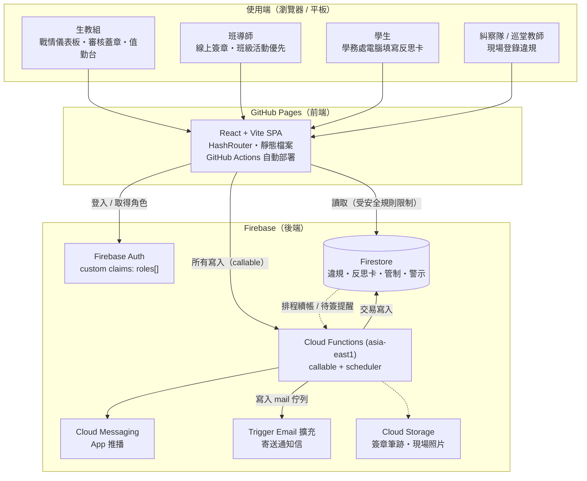

# 技術架構

## 1. 架構總覽

前端為 **GitHub Pages 靜態站**，後端為 **Firebase**（Firestore + Cloud Functions + Auth + FCM）。
校內無需自建伺服器與資料庫，學務處只要有瀏覽器即可作業。



## 2. 技術選型與理由

| 層 | 選用 | 理由 |
|---|---|---|
| 前端 | React 18 + Vite + TypeScript | 靜態輸出即可放 GitHub Pages；型別與領域模型共用一套命名 |
| 路由 | HashRouter | Pages 無伺服器端 rewrite，hash 路由避免深層路徑 404（另備 `404.html` fallback） |
| 樣式 | 原生 CSS + 設計代幣 | 無框架依賴、載入快；深色模式為獨立色階而非自動反轉 |
| 身分 | Firebase Auth + custom claims | 角色寫在 token 內，安全規則可直接引用，免額外讀取成本 |
| 資料庫 | Firestore | 免運維、即時同步（審核佇列自動更新）、依文件計價適合校園量級 |
| 商業邏輯 | Cloud Functions（callable） | 累犯偵測必須在**交易**中執行；簽章時間、認列欄位不可由前端決定 |
| 通知 | FCM + Trigger Email 擴充 | 推播與 Email 雙軌；SMTP 憑證交由擴充套件保管，不落地於程式碼 |
| 排程 | Cloud Scheduler（`onSchedule`） | 每日 07:10 管制續帳、15:40 待簽提醒 |
| 區域 | `asia-east1`（台灣） | 校內連線延遲最低 |

## 3. 專案結構

```
C.A.R.E.-System/
├── functions/                    # 後端（Cloud Functions, TypeScript）
│   ├── src/domain/               # 純領域層（無 I/O，可單元測試）
│   │   ├── types.ts              #   型別與狀態常數
│   │   ├── dates.ts              #   Asia/Taipei 校務日期・15 天視窗・下一個上課日
│   │   ├── recidivism.ts         #   ★ 累犯偵測演算法
│   │   └── workflow.ts           #   ★ 雙重審核狀態機（含班級活動優先豁免）
│   ├── src/data/                 # Firestore 集合定義與查詢
│   ├── src/services/             # 違規登錄・案件審核・累犯交易・觀察員・管制帳
│   ├── src/notifications/        # 推播與 Email 模板
│   ├── src/handlers/             # callable 端點・排程・角色管理
│   └── test/                     # vitest（39 項）
├── web/                          # 前端（React + Vite）
│   ├── src/lib/api.ts            # 單一資料入口（live / mock 雙模式）
│   ├── src/pages/                # 生教組 6 頁 + 導師 + 學生
│   └── src/components/           # 版面骨架・審核抽屜・圖表・UI 元件
├── firestore.rules               # 角色化授權（寫入預設全拒）
├── firestore.indexes.json        # 16 組複合索引（含累犯視窗查詢）
├── seed/                         # 系統參數・反思卡題目・示範資料
├── docs/sql/                     # 累犯演算法的 SQL 等價實作 + 自我驗證腳本
└── .github/workflows/            # CI・Pages 部署・Firebase 部署
```

## 4. 分層原則

1. **領域層不碰 I/O**：`domain/` 只做判斷與計算，輸入是資料、輸出是「新狀態 + 副作用清單」。
   累犯門檻、視窗邊界、解鎖時點等規則因此能以單元測試釘住（39 項）。
2. **副作用由 services 執行**：狀態機回傳 `LIFT_RESTRICTION`、`EVALUATE_RECIDIVISM`、
   `SCHEDULE_UNLOCK`、`NOTIFY` 等 effect，services 層才真正寫 Firestore、發推播。
   換通知管道或調整解鎖政策時，不需要動狀態機。
3. **前端不持有規則**：前端只顯示後端算好的狀態與進度；`web/src/lib/mock.ts` 雖複製了
   規則以便離線示範，但正式判定一律以 Cloud Functions 為準。

## 5. 安全模型

| 對象 | 讀取 | 寫入 |
|---|---|---|
| 生教組 `DISCIPLINE_STAFF` | 全校違規、反思卡、管制、警示、派單 | 僅透過 callable |
| 班導師 `HOMEROOM_TEACHER` | 限本班（以 `classes/{id}.homeroomTeacherUid` 判定） | 僅透過 callable |
| 學生 `STUDENT` | 限本人案件與管制狀態 | 僅可暫存自己 `DRAFT`/`RETURNED` 卡片的 `answers` |
| 糾察隊 `PATROL` | 不可讀取他人歷程 | 僅可呼叫 `createInfraction` |
| 家長 | 不開放登入，以 Email 通知 | — |

* 業務集合的 `create/update/delete` 在安全規則中**預設全部拒絕**，寫入只能經 callable，
  因此簽章時間、`consumedByAlertId`（累犯認列）、管制狀態都無法由前端偽造。
* 所有時間戳由伺服器產生並以 ISO-8601 字串儲存（字典序 = 時間序，便於索引與匯出）。
* 每次簽章計算 SHA-256 雜湊（案件 ID + 關卡 + 簽核者 + 決定 + 伺服器時戳），事後可驗證未被篡改。
* `auditLogs` 記錄每一次登錄、簽章、蓋章、豁免、撤銷，僅管理者可讀。

## 6. 成本概估（以 1,000 名學生、每日 10 件違規估算）

| 項目 | 月用量估計 | 說明 |
|---|---|---|
| Firestore 讀取 | < 50 萬次 | 儀表板每次開啟約 6 次查詢；免費額度 5 萬次/日 |
| Firestore 寫入 | < 2 萬次 | 每件違規約 6 次寫入（事件、卡片、管制、通知、稽核） |
| Functions 呼叫 | < 1 萬次 | 免費額度 200 萬次/月 |
| GitHub Pages | 免費 | 靜態流量 |

一般國中小規模預期落在 Firebase 免費方案（Spark）或極低額度的 Blaze 方案內；
Cloud Functions 需啟用 Blaze 才能對外呼叫，但用量仍在免費額度內。
