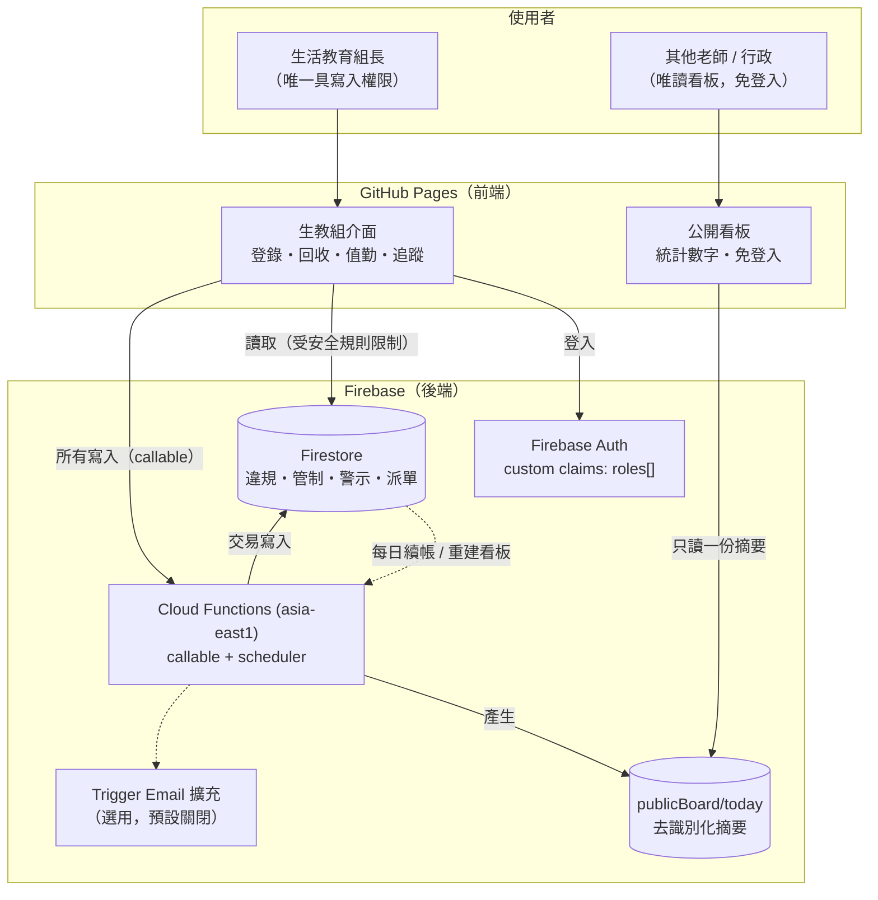

# 技術架構

## 1. 系統定位

**一人操作的工具**：生活教育組長登入使用；其他老師透過公開唯讀看板查看概況，不需帳號。
紙本反思卡與行為檢討書維持現行作業，系統只紀錄「是否回收」以決定管制解除，
核心價值在於自動計算 **15 天內的再犯次數**與後續追蹤。

## 2. 架構總覽



## 3. 技術選型與理由

| 層 | 選用 | 理由 |
|---|---|---|
| 前端 | React 18 + Vite + TypeScript | 靜態輸出即可放 GitHub Pages |
| 路由 | HashRouter | Pages 無伺服器端 rewrite（另備 `404.html` fallback） |
| 樣式 | 原生 CSS + 設計代幣 | 無框架依賴、載入快；深色模式為獨立色階 |
| 身分 | Firebase Auth + custom claims | 角色寫在 token 內，安全規則可直接引用 |
| 資料庫 | Firestore | 免運維、即時同步、依文件計價適合校園量級 |
| 商業邏輯 | Cloud Functions（callable） | 再犯偵測必須在**交易**中執行；認列欄位不可由前端決定 |
| 排程 | Cloud Scheduler（`onSchedule`） | 每上課日 07:10 管制續帳與重建公開看板 |
| 通知 | Trigger Email 擴充（選用） | 預設關閉；開啟後才寄信通知導師 |
| 區域 | `asia-east1`（台灣） | 校內連線延遲最低 |

## 4. 專案結構

```
C.A.R.E.-System/
├── functions/                    # 後端（Cloud Functions, TypeScript）
│   ├── src/domain/               # 純領域層（無 I/O，可單元測試）
│   │   ├── types.ts              #   型別與狀態常數
│   │   ├── dates.ts              #   Asia/Taipei 校務日期・15 天視窗・下一個上課日
│   │   ├── recidivism.ts         #   ★ 再犯偵測演算法
│   │   └── caseRules.ts          #   紙本回收／免記／撤銷的規則與解鎖日計算
│   ├── src/data/                 # Firestore 集合定義與查詢
│   ├── src/services/             # 違規登錄・再犯交易・觀察員・管制帳・公開看板
│   ├── src/handlers/             # callable 端點・排程・角色與設定管理
│   └── test/                     # vitest（33 項）＋ emulator 規則測試（9 項）
├── web/                          # 前端（React + Vite）
│   ├── src/lib/api.ts            # 單一資料入口（live / mock 雙模式）
│   ├── src/pages/                # 公開看板 + 生教組 7 頁
│   └── src/components/           # 版面骨架・圖表・UI 元件
├── firestore.rules               # 未登入僅可讀公開看板；業務寫入一律經 callable
├── firestore.indexes.json        # 8 組複合索引（含再犯視窗查詢）
├── seed/                         # 系統參數、違規類型、地點、示範資料
├── docs/sql/                     # 再犯演算法的 SQL 等價實作 + 自我驗證腳本
└── .github/workflows/            # CI・Pages 部署・Firebase 部署
```

## 5. 分層原則

1. **領域層不碰 I/O**：`domain/` 只做判斷與計算。再犯門檻、視窗邊界、解鎖時點
   因此能以單元測試釘住（33 項）。
2. **服務層負責副作用**：Firestore 寫入、管制帳異動、公開看板重建都在 `services/`。
3. **前端不持有規則**：前端只顯示後端算好的狀態；`web/src/lib/mock.ts` 雖複製了
   規則以便離線示範，正式判定一律以 Cloud Functions 為準。

## 6. 權限與隱私模型

| 對象 | 讀取 | 寫入 |
|---|---|---|
| 生活教育組長 `DISCIPLINE_STAFF` | 全部業務資料 | 僅透過 callable |
| 系統管理者 `ADMIN` | 全部 + 稽核軌跡 | 僅透過 callable |
| 其他老師 / 任何人 | **只有** `publicBoard/today`（去識別化摘要） | 無 |

* 業務集合的 `create/update/delete` 在安全規則中**全部拒絕**，寫入只能經 callable，
  因此認列欄位（`consumedByAlertId`）、管制狀態、時間戳都無法由前端偽造。
* 公開頁**不接觸任何業務集合**，只讀伺服器產生的摘要文件。
  預設僅含統計數字；開啟 `settings.publicBoard.showRoster` 後最多只輸出班級＋座號。
  > 提醒：即使只有班級與座號，校內同學仍可辨識當事人，等同公開懲戒。
  > 開啟前請確認符合校內個資與輔導管教規範。
* 所有時間戳由伺服器產生並以 ISO-8601 字串儲存。
* `auditLogs` 記錄每一次登錄、回收、免記、撤銷、改期與設定變更，僅 `ADMIN` 可讀。
* 規則不只人工審閱：`functions/test/emulator/rules.test.ts` 以 Firestore 模擬器
  實測 9 項情境（未登入、無角色、組長、管理者），並納入 CI（`npm run test:rules`）。

## 7. 成本概估（1,000 名學生、每日 10 件違規）

| 項目 | 月用量估計 | 說明 |
|---|---|---|
| Firestore 讀取 | < 20 萬次 | 公開看板只讀 1 份文件，成本極低 |
| Firestore 寫入 | < 1 萬次 | 每件違規約 4 次寫入（事件、管制、看板、稽核） |
| Functions 呼叫 | < 5 千次 | 免費額度 200 萬次/月 |
| GitHub Pages | 免費 | 靜態流量 |

一般國中小規模預期落在 Firebase 免費額度內；Cloud Functions 需啟用 Blaze 方案
才能對外呼叫，但用量仍在免費額度內。
