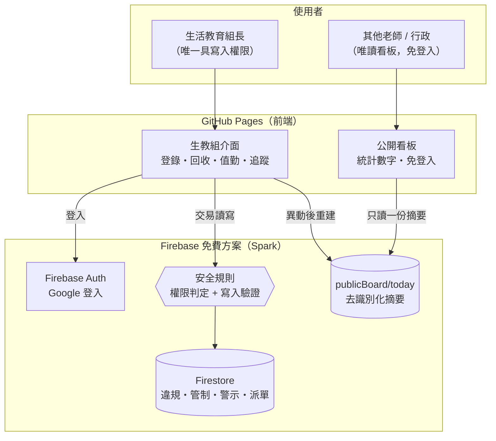

# 技術架構

## 1. 系統定位

**一人操作的工具**：生活教育組長登入使用；其他老師透過公開唯讀看板查看概況，不需帳號。
紙本反思卡與行為檢討書維持現行作業，系統只紀錄「是否回收」以決定管制解除，
核心價值在於自動計算 **15 天內的再犯次數**與後續追蹤。

## 2. 為什麼沒有 Cloud Functions

Cloud Functions 需要 Firebase 的 **Blaze（付費）方案**。本系統使用者只有 1–2 人、
資料量小，因此改採**完全在免費 Spark 方案內**的架構：

| 原本（付費方案） | 現在（免費方案） |
|---|---|
| 業務邏輯在 Cloud Functions | 在前端 `web/src/core/services/`，以 **Firestore 交易**保證原子性 |
| 角色存於 Auth custom claims（需 Admin SDK） | 存於 `staff/{uid}.roles`，安全規則以 `get()` 讀取判定 |
| 排程函式每日續帳 | 生教組端**每天第一次開啟系統**時執行（`systemState/dailySync` 記錄） |
| 函式產生公開看板 | 生教組端於每次異動後重建 `publicBoard/today` |
| 函式驗證輸入 | **安全規則**驗證資料形狀、時間戳與提權（27 項測試） |

代價與對策：

* **安全規則成為唯一防線** → 規則除了權限也驗證欄位形狀、狀態轉換與
  `request.time` 時間戳，並以模擬器測試覆蓋（`npm run test:rules`）。
* **無伺服器端排程** → 續帳改為開啟系統時執行；管制帳以日期為鍵，
  重複執行不會產生重複資料，隔幾天才開也會一併補上。
* **交易內不能下查詢**（用戶端 SDK 限制）→ 再犯計數改讀
  `students/{id}.recidivismWindow` 快取（見 [再犯偵測演算法](recidivism-algorithm.md)）。

## 3. 架構總覽



## 3. 技術選型與理由

| 層 | 選用 | 理由 |
|---|---|---|
| 前端 | React 18 + Vite + TypeScript | 靜態輸出即可放 GitHub Pages |
| 路由 | HashRouter | Pages 無伺服器端 rewrite（另備 `404.html` fallback） |
| 樣式 | 原生 CSS + 設計代幣 | 無框架依賴、載入快；深色模式為獨立色階 |
| 身分 | Firebase Auth（**Google 登入**）+ custom claims | 沿用學校 Google 帳號，免另建密碼；角色寫在 token 內，安全規則可直接引用 |
| 資料庫 | Firestore | 免運維、即時同步、依文件計價適合校園量級 |
| 商業邏輯 | 前端 + Firestore 交易 | 免付費方案；單人操作，交易即足以避免重複觸發 |
| 授權 | 安全規則 + `staff/{uid}.roles` | 取消授權下一次請求即生效，不必等 token 過期 |
| 排程 | 開啟系統時的每日續帳 | 免費方案無 Cloud Scheduler；以日期為鍵，重複執行安全 |
| 區域 | `asia-east1`（台灣） | 校內連線延遲最低 |

## 4. 專案結構

```
C.A.R.E.-System/
├── web/                          # 前端（React + Vite）＝ 整個系統
│   ├── src/core/domain/          # 純領域層（無 I/O，可單元測試）
│   │   ├── types.ts              #   型別與狀態常數
│   │   ├── dates.ts              #   Asia/Taipei 校務日期・15 天視窗・下一個上課日
│   │   ├── recidivism.ts         #   ★ 再犯偵測演算法
│   │   └── caseRules.ts          #   紙本回收／免記／撤銷的規則與解鎖日計算
│   ├── src/core/services/        # 以 Firestore 交易實作的業務流程
│   │   ├── infractions.ts        #   ★ 違規登錄（交易內完成計數與觸發）
│   │   ├── observers.ts          #   安全觀察員值勤與結案
│   │   ├── restrictions.ts       #   下課管制每日帳
│   │   ├── access.ts             #   帳號授權（領取／指派／取消）
│   │   ├── dailySync.ts          #   每日續帳（取代排程函式）
│   │   └── publicBoard.ts        #   去識別化公開摘要
│   ├── src/lib/api.ts            # 單一資料入口（live / mock 雙模式）
│   ├── src/pages/                # 公開看板 + 生教組 7 頁
│   └── test/                     # vitest（33 項）＋ 模擬器規則測試（27 項）
├── firestore.rules               # 唯一防線：權限判定 + 每筆寫入的形狀與時間戳驗證
├── firestore.indexes.json        # 8 組複合索引（含再犯視窗查詢）
├── seed/                         # 系統參數、違規類型、地點、示範資料
├── docs/sql/                     # 再犯演算法的 SQL 等價實作 + 自我驗證腳本
└── .github/workflows/            # CI・Pages 部署・Firebase 部署
```

## 5. 分層原則

1. **領域層不碰 I/O**：`domain/` 只做判斷與計算。再犯門檻、視窗邊界、解鎖時點
   因此能以單元測試釘住（33 項）。
2. **服務層負責副作用**：Firestore 寫入、管制帳異動、公開看板重建都在 `services/`。
3. **領域層與服務層分離**：`core/domain` 只做判斷與計算（可單元測試），
   `core/services` 負責 Firestore 交易與副作用；`web/src/lib/mock.ts` 雖複製了
   規則以便離線示範，正式判定一律以 Firestore 交易與安全規則為準。

## 6. 權限與隱私模型

| 對象 | 讀取 | 寫入 |
|---|---|---|
| 生活教育組長 `DISCIPLINE_STAFF` | 全部業務資料 | 受安全規則驗證的寫入 |
| 系統管理者 `ADMIN` | 全部 + 稽核軌跡 | 同上，另可管理帳號與系統設定 |
| 其他老師 / 任何人 | **只有** `publicBoard/today`（去識別化摘要） | 無 |

### 授權鏈（Google 登入）

```
Console 手動建立（或 seed 指令）accessGrants/{管理者信箱}
        │  管理者以 Google 登入 → 讀「自己那筆」授權 → 建立 staff/{uid}
        │  （規則驗證 roles 必須等於授權內容，無法自行提權）
        ▼
    ADMIN（可進入「帳號管理」）
        │  寫入 accessGrants/{同仁信箱}
        ▼
  生活教育組長以 Google 登入 → 同樣流程建立自己的 staff/{uid}
```

* 授權可在對方登入前先建立（`accessGrants` 以信箱為鍵），對方首次登入即生效。
* `accessGrants` 只允許**讀自己那一筆**（管理者可讀全部），避免列舉校內信箱；
  寫入僅限管理者。
* 取消授權後，下一次請求規則重新讀 `staff` 文件即失效 ——
  比 custom claims 還即時（後者要等 token 過期）。
* 規則禁止使用者寫入超出授權的角色，因此無法自行提權（有測試覆蓋）。

* 安全規則驗證每一筆寫入：登錄者必須是本人、`createdAt/updatedAt` 必須等於
  `request.time`（伺服器時間）、違規的學生與發生日不可事後竄改、違規不可刪除、
  管制帳的「可正常飲水與如廁」必須為 true、學生主檔只能改再犯視窗快取。
* 公開頁**不接觸任何業務集合**，只讀伺服器產生的摘要文件。
  預設僅含統計數字；開啟 `settings.publicBoard.showRoster` 後最多只輸出班級＋座號。
  > 提醒：即使只有班級與座號，校內同學仍可辨識當事人，等同公開懲戒。
  > 開啟前請確認符合校內個資與輔導管教規範。
* 時間戳使用 `serverTimestamp()`，規則強制其等於 `request.time`，前端無法造假。
* `auditLogs` 記錄每一次登錄、回收、免記、撤銷、改期與設定變更，僅 `ADMIN` 可讀。
* 規則不只人工審閱：`web/test/emulator/rules.test.ts` 以 Firestore 模擬器
  實測 **28 項**情境（匿名、無角色、提權嘗試、偽造登錄者、竄改時間戳、
  刪除違規、停用帳號等），並納入 CI（`npm run test:rules`）。

## 7. 讀取次數的控制

免費方案每日 5 萬次讀取，若不節制，幾個動作就會吃掉大半：

| 機制 | 作法 | 效果（1,000 名學生） |
|---|---|---|
| **名冊索引** | 搜尋用欄位壓成 `rosterIndex/chunk_*` 聚合文件（每份 500 人），只在匯入名冊時重寫 | 搜尋載入 **1,000 → 2 次**讀取 |
| **索引快取** | localStorage 保存 12 小時，匯入後主動失效 | 同一台電腦當天幾乎 **0 次** |
| **再犯次數延後查** | 索引不存次數（每次登錄都會變）；選定學生後才讀他那一份 | 每次選人 **1 次**，取代整批帶出 |
| **設定快取** | `settings/system` 記憶體快取 10 分鐘，存檔後失效 | 每個操作省 **1 次** |
| **看板節流** | 公開看板最短 5 分鐘重建一次，而非每筆登錄都重建 | 連續登錄時省下 **每筆約 200 次** |

> 仍可再優化：儀表板與公開看板的趨勢圖目前掃 14 天的 `infractions`（約 200 筆）。
> 若改為登錄時以 `increment()` 累加到 `dailyStats/{date}`，儀表板只需讀 14 份文件。
> 這會動到資料模型且需回填歷史，因此保留為後續選項。

## 8. 成本（1,000 名學生、每日 10 件違規）

**完全在 Firebase 免費方案（Spark）額度內，不需綁信用卡。**

| 項目 | 免費額度（每日） | 預估用量 |
|---|---|---|
| Firestore 讀取 | 50,000 | < 1,000（見上節的節流機制；含規則判定的 staff 讀取） |
| Firestore 寫入 | 20,000 | < 300 |
| Firestore 儲存 | 1 GiB | < 10 MB／學年 |
| Authentication | 無限制 | — |
| GitHub Pages | 免費 | — |
