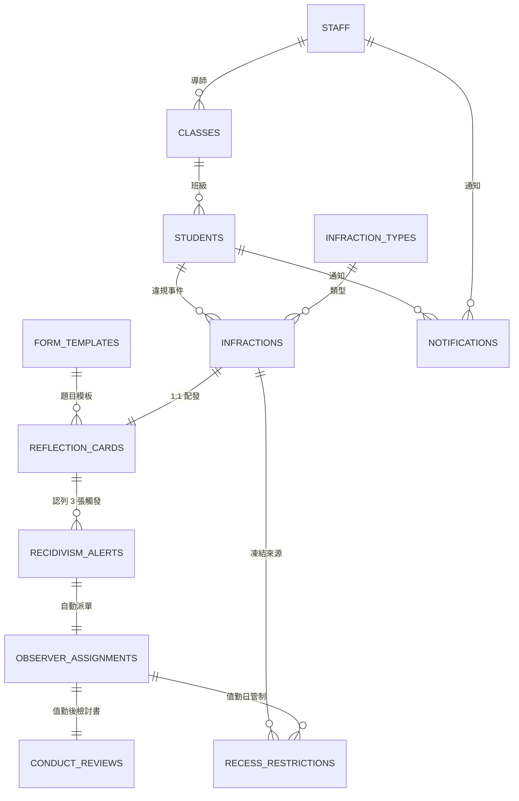

# 資料庫綱要（Firestore）

> 正式資料庫為 Firestore（NoSQL 文件型）。
> 若需關聯式（PostgreSQL / BigQuery）對應，見 [`sql/recidivism.sql`](sql/recidivism.sql)。

## 0. 設計原則

1. **文件 ID 用自然鍵去重**
   `recessRestrictions/{studentId}_{YYYY-MM-DD}` → 每生每日僅一筆管制帳，
   同日多次違規只會累加 `reasons`，不會重複剝奪權益。
2. **有限度反正規化**
   清單類畫面（今日管制名單、審核佇列）直接帶 `studentNo / studentName / className`，
   避免 N+1 讀取；學生轉班或改名時由 Cloud Functions 一次性回寫（低頻操作）。
3. **日期與時間分工**
   - 「天」的概念用 `YYYY-MM-DD` 字串（Asia/Taipei）：`countOn`、`date`、`dutyOn`、`unlockOn`。
     字典序 = 時間序，可直接做範圍查詢，且不受 UTC 位移影響。
   - 「時點」用 ISO-8601 字串（UTC）：`createdAt`、`submittedAt`、`actedAt`。
     由伺服器寫入，前端無寫入權限。
4. **累犯認列欄位**
   `reflectionCards.consumedByAlertId` 未認列時**明確寫入 `null`**
   （Firestore 不索引缺漏欄位，缺值會讓卡片消失於查詢）。
5. **參數外置**
   15 天 / 3 張 / 5 節皆存於 `settings/system`，調整校規不需改程式；
   警示文件同時留存當時的參數快照（`windowDays`、`threshold`），維持可追溯性。

## 1. 實體關係



## 2. 集合一覽

| 集合 | 文件 ID | 用途 | 主要查詢 |
|---|---|---|---|
| `settings` | `system` | 15 天 / 3 張 / 5 節等參數 | 直接讀取 |
| `schoolCalendar` | `YYYY-MM-DD` | 假日與補課日（決定「隔日」） | 日期範圍 |
| `classes` | `cls_701` | 班級與導師 uid | 導師查自己班級 |
| `students` | `stu_701_01` | 學生主檔 + FCM token | 學號比對、班級清單 |
| `staff` | Auth uid | 教職員、角色、FCM token | `roles array-contains` |
| `infractionTypes` | `RUN_IN_CORRIDOR` | 違規類型 → 對應反思卡 | 依 `order` |
| `formTemplates` | `SAFETY_REFLECTION_V1` | 反思卡 / 檢討書題目 | `kind + active` |
| `locations` | `CORRIDOR_2F` | 校園地點、是否熱點 | 全取 |
| `infractions` | auto | 違規事件 | 狀態 + 發生日、班級、學生 |
| `reflectionCards` | auto | 反思卡（**累犯計數來源**） | ★ 累犯視窗、審核佇列 |
| `recessRestrictions` | `{studentId}_{date}` | 下課管制每日帳 | `date ==` 今日 |
| `recidivismAlerts` | auto | 累犯警示 | 狀態 + 觸發時間 |
| `observerAssignments` | auto | 安全觀察員派單 | 狀態 + 值勤日 |
| `conductReviews` | auto | 行為檢討書 | 狀態 + 送出時間 |
| `notifications` | auto | 通知紀錄（查核是否已通知導師） | 收件者 + 時間 |
| `mail` | auto | Trigger Email 擴充的寄信佇列 | 僅後端 |
| `auditLogs` | auto | 稽核軌跡 | 僅管理者 |

## 3. 主要文件結構

### 3.1 `settings/system`

```jsonc
{
  "recidivismWindowDays": 15,      // 回溯天數（含當天）
  "recidivismThreshold": 3,        // 觸發張數
  "observerPeriods": 5,            // 安全觀察員值勤節數
  "observerPeriodNumbers": [1,2,3,4,5],
  "timezone": "Asia/Taipei",
  "notifications": { "push": true, "email": true }
}
```

### 3.2 `infractions/{infractionId}` — 違規事件

```jsonc
{
  "studentId": "stu_701_01",
  "studentNo": "1140101", "studentName": "王小明",
  "classId": "cls_701", "className": "七年一班",

  "typeCode": "RUN_IN_CORRIDOR", "typeName": "走廊奔跑",
  "formKind": "SAFETY_REFLECTION",           // 決定配發哪張反思卡

  "occurredAt": "2026-09-18T02:10:00.000Z",  // 時點（UTC）
  "occurredOn": "2026-09-18",                // 校務日期＝累犯基準日
  "periodNo": 2,
  "locationCode": "CORRIDOR_2F", "locationName": "二樓走廊",
  "locationDetail": "靠樓梯轉角", "description": "與同學追逐",

  "reporter": { "uid": "uid_patrol_01", "name": "張家豪", "role": "PATROL" },

  "status": "OPEN",                  // OPEN | RESOLVED | EXEMPTED | VOIDED
  "reflectionCardId": "card_xxx",
  "exemption": {                     // 導師勾選「班級活動優先」時寫入
    "applied": true, "reason": "班際籃球賽練習",
    "byUid": "uid_teacher_701", "byName": "陳怡君",
    "at": "2026-09-18T05:00:00.000Z"
  },
  "createdAt": "...", "updatedAt": "..."
}
```

### 3.3 `reflectionCards/{cardId}` — 反思卡（累犯計數的唯一來源）

```jsonc
{
  "infractionId": "inf_xxx",
  "studentId": "stu_701_01", "studentNo": "1140101", "studentName": "王小明",
  "classId": "cls_701",

  "templateId": "SAFETY_REFLECTION_V1", "templateVersion": 1,
  "formKind": "SAFETY_REFLECTION",
  "formTitle": "校園安全反思卡",

  "status": "PENDING_OFFICE",
  // DRAFT → PENDING_TEACHER → PENDING_OFFICE → COMPLETED
  //       ↘ RETURNED（退回補正）  ↘ EXEMPTED（班級活動優先）  ↘ VOIDED（撤銷）

  "countOn": "2026-09-18",           // ★ 累犯基準日＝違規發生日（非填寫日）
  "countsTowardRecidivism": true,    // ★ 豁免/撤銷 → false
  "consumedByAlertId": null,         // ★ 已被警示認列的 alertId；未認列必須是 null

  "answers": { "what_happened": "…", "next_time": "…", "self_rating": 4 },

  "submittedAt": "2026-09-18T03:05:00.000Z",
  "approvals": [
    { "stage": "HOMEROOM_TEACHER", "decision": "SIGNED",
      "actorUid": "uid_teacher_701", "actorName": "陳怡君",
      "comment": "已與學生談過", "signatureHash": "a3f1…",
      "actedAt": "2026-09-18T04:00:00.000Z" }
  ],
  "teacherSignedAt": "…", "officeStampedAt": null, "completedAt": null,
  "returnCount": 0,
  "createdAt": "…", "updatedAt": "…"
}
```

`status` 與累犯計數的關係：

| 狀態 | 含義 | 計入累犯？ |
|---|---|---|
| `DRAFT` | 已配發、學生尚未填寫 | ✗ |
| `PENDING_TEACHER` | 學生已送出，待導師簽章 | ✓ |
| `PENDING_OFFICE` | 導師已簽章，待生教組蓋章 | ✓ |
| `COMPLETED` | 雙重審核完成 | ✓ |
| `RETURNED` | 退回補正中 | ✗ |
| `EXEMPTED` | 導師班級活動優先 | ✗（同時 `countsTowardRecidivism=false`） |
| `VOIDED` | 誤報撤銷 | ✗ |

> 規格寫的是「累計**填寫**紀錄」，故學生一送出即計入，不必等審核完成 —
> 避免導師晚簽章就延後處分的漏洞。

### 3.4 `recessRestrictions/{studentId}_{YYYY-MM-DD}` — 下課管制每日帳

```jsonc
{
  "studentId": "stu_701_01", "studentNo": "1140101", "studentName": "王小明",
  "classId": "cls_701", "className": "七年一班",
  "date": "2026-09-18",
  "reasons": ["INFRACTION_REFLECTION"],
  // INFRACTION_REFLECTION（待完成反思卡）
  // OBSERVER_DUTY（安全觀察員值勤日）
  // OBSERVER_REVIEW_PENDING（檢討書尚未通過）
  "sourceRefs": [{ "reason": "INFRACTION_REFLECTION", "infractionId": "inf_xxx", "assignmentId": null }],
  "status": "ACTIVE",                  // ACTIVE | LIFTED | CANCELLED
  "allowWaterAndRestroom": true,       // 正向管教：永遠 true，UI 固定顯示
  "periods": [],                       // 觀察員值勤時為 [1,2,3,4,5]
  "note": "走廊奔跑｜待完成校園安全反思卡",
  "liftedAt": null, "liftReason": null
}
```

**為何採「每日一筆」而非「起訖區間」**

- 學務處最常問「今天誰要管制？」→ 單欄位查詢 `date == today`，成本最低。
- 多重來源共存時（同日既要補卡又要值勤），只有全部來源解除才會 `LIFTED`，
  不會因完成反思卡就誤放了值勤義務。
- 未完成的案件由排程每日 07:10「續帳」到當天，等同紙本每日重開一頁。

### 3.5 `recidivismAlerts/{alertId}` — 累犯警示

```jsonc
{
  "studentId": "stu_802_05", "studentNo": "1130205", "studentName": "黃彥霖",
  "classId": "cls_802", "className": "八年二班",
  "triggeredAt": "2026-09-16T04:20:00.000Z",
  "windowDays": 15, "threshold": 3,        // 觸發當時的參數快照
  "windowStart": "2026-09-02", "windowEnd": "2026-09-16",
  "cardCount": 3,
  "triggerCardId": "card_c3",
  "cardIds": ["card_c1", "card_c2", "card_c3"],   // 本次認列的卡片
  "breakdown": [
    { "cardId": "card_c1", "formKind": "SAFETY_REFLECTION", "countOn": "2026-09-06" },
    { "cardId": "card_c2", "formKind": "KIND_WORDS_REFLECTION", "countOn": "2026-09-12" },
    { "cardId": "card_c3", "formKind": "SAFETY_REFLECTION", "countOn": "2026-09-16" }
  ],
  "status": "ASSIGNED",   // OPEN | ACKNOWLEDGED | ASSIGNED | CLOSED | DISMISSED
  "assignmentId": "asg_xxx"
}
```

### 3.6 `observerAssignments/{assignmentId}` — 安全觀察員派單

```jsonc
{
  "alertId": "alert_xxx",
  "studentId": "stu_802_05", "studentName": "黃彥霖", "className": "八年二班",
  "dutyOn": "2026-09-18",              // 值勤日（預設下一個上課日，可由生教組改期）
  "totalPeriods": 5,                   // 一日下課共 5 節（扣除打掃與 5 分鐘短下課）
  "periodLogs": [
    { "periodNo": 1, "checkInAt": "…", "checkOutAt": "…", "observedCount": 3,
      "note": "三樓走廊提醒 3 位同學", "verifiedByUid": "uid_office_01" },
    { "periodNo": 2 }, { "periodNo": 3 }, { "periodNo": 4 }, { "periodNo": 5 }
  ],
  "supervisor": { "uid": "uid_office_01", "name": "王淑芬" },
  "status": "IN_PROGRESS",
  // SCHEDULED → IN_PROGRESS → DUTY_COMPLETED → REVIEW_PENDING → CLOSED（或 CANCELLED）
  "conductReviewId": "rev_xxx",
  "unlockOn": "2026-09-19"             // 檢討書通過後寫入＝下一個上課日
}
```

### 3.7 `conductReviews/{reviewId}` — 行為檢討書

結構與 `reflectionCards` 相同（共用狀態機與審核流程），額外欄位：

```jsonc
{
  "assignmentId": "asg_xxx",
  "completedOn": "2026-09-18",   // 完成雙重審核之校務日期
  "unlockOn": "2026-09-19"       // ＝ nextSchoolDay(completedOn)，隔日解鎖
}
```

### 3.8 `formTemplates/{templateId}` — 表單模板

題目以資料驅動，新增題目不需改前端程式：

```jsonc
{
  "kind": "SAFETY_REFLECTION",          // SAFETY_REFLECTION | KIND_WORDS_REFLECTION | CONDUCT_REVIEW
  "title": "校園安全反思卡",
  "subtitle": "適用：走廊奔跑",
  "version": 1, "active": true,
  "guidance": "這張卡不是處罰，而是幫你想清楚「怎麼保護自己與同學」…",
  "sections": [
    { "id": "review", "title": "一、事件回顧",
      "questions": [
        { "id": "what_happened", "type": "textarea", "label": "我在什麼時間、哪個地點、做了什麼？",
          "required": true, "minLength": 20, "placeholder": "例：…" },
        { "id": "speed_reason", "type": "choice", "label": "當時為什麼會跑？",
          "required": true, "options": ["趕時間", "跟同學追逐", "情緒激動", "沒注意到規定", "其他"] }
      ] }
  ]
}
```

支援題型：`text`、`textarea`、`choice`、`multiselect`、`scale`、`number`。
必填與最少字數於前端即時提示、後端 `assertAnswersComplete()` 再次驗證（以後端為準）。
實際題目見 [`../seed/templates.json`](../seed/templates.json)。

## 4. 複合索引

完整定義見 [`../firestore.indexes.json`](../firestore.indexes.json)，關鍵者：

| 集合 | 欄位順序 | 服務的查詢 |
|---|---|---|
| `reflectionCards` | `studentId`, `countsTowardRecidivism`, `consumedByAlertId`, `status`, `countOn` | ★ 累犯 15 天視窗 |
| `reflectionCards` | `status`, `teacherSignedAt` | 生教組待蓋章佇列（先進先出） |
| `reflectionCards` | `classId`, `status`, `submittedAt` | 導師待簽章佇列 |
| `reflectionCards` | `status`, `countOn` | 排程續帳（未結案且早於今日） |
| `recessRestrictions` | `date`, `className` | 今日管制名單 |
| `recessRestrictions` | `studentId`, `status`, `date` | 解鎖時清除後續管制 |
| `observerAssignments` | `status`, `dutyOn` | 安全觀察員追蹤清單 |
| `recidivismAlerts` | `status`, `triggeredAt` | 警示板 |
| `staff` | `roles`(array-contains), `active` | 通知生教組全體 |

> Firestore 複合索引的欄位順序規則：**等值條件在前、範圍／排序在後**。
> `status IN [...]` 視為等值條件，故 `countOn` 的範圍條件必須排在最後。

## 5. 安全規則要點

完整規則見 [`../firestore.rules`](../firestore.rules)。

- 業務集合 `create / delete` 與大部分 `update` 一律 `false`，寫入只能經 Cloud Functions。
- 唯二例外（以 `diff().affectedKeys().hasOnly()` 限制欄位）：
  1. 學生暫存自己 `DRAFT`/`RETURNED` 卡片的 `answers`
  2. 使用者更新自己的 `fcmTokens`
- 讀取依角色縮限：生教組全校、導師限本班（查 `classes.homeroomTeacherUid`）、學生限本人。
- `mail`（寄信佇列）對前端完全關閉；`auditLogs` 僅 `ADMIN` 可讀。

規則以 Firestore 模擬器實測 16 項情境（見
[`../functions/test/emulator/rules.test.ts`](../functions/test/emulator/rules.test.ts)），
其中特別驗證：生教組即使有讀取權也無法直接寫入業務集合、導師不可讀他班案件、
學生無法藉「暫存作答」夾帶 `status` / `countsTowardRecidivism` / `consumedByAlertId`。
執行：`npm run test:rules`。

## 6. 關聯式（SQL）對應

若校方要改用 Cloud SQL / PostgreSQL，或需匯出至 BigQuery 做期末統計：

| Firestore | SQL |
|---|---|
| `reflectionCards` | `reflection_cards`（`countOn` → `count_on date`） |
| `consumedByAlertId: null` | `consumed_by_alert_id IS NULL` |
| `status IN [...]` | `status IN (...)` 或 `countable_cards` 檢視 |
| 交易 + 認列 | `trigger_recidivism_if_needed()`（`SELECT … FOR UPDATE`） |

DDL、查詢函式與 10 項自我驗證斷言見 [`sql/recidivism.sql`](sql/recidivism.sql)
與 [`sql/recidivism_test.sql`](sql/recidivism_test.sql)（已於 PostgreSQL 16 執行通過）。
