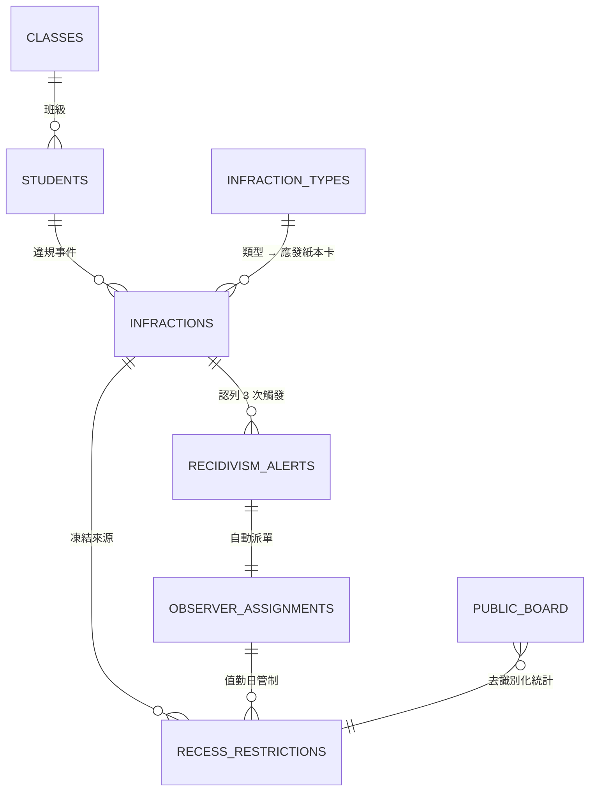

# 資料庫綱要（Firestore）

> 正式資料庫為 Firestore（NoSQL 文件型）。
> 關聯式（PostgreSQL / BigQuery）對應見 [`sql/recidivism.sql`](sql/recidivism.sql)。

## 0. 設計原則

1. **違規事件是唯一的計次來源**
   系統不存紙本反思卡內容（紙本照舊），因此 `infractions` 同時扮演
   「事件紀錄」與「再犯計次」兩個角色，資料模型因而大幅簡化。
2. **文件 ID 用自然鍵去重**
   `recessRestrictions/{studentId}_{YYYY-MM-DD}` → 每生每日僅一筆管制帳，
   同日多次違規只會累加 `reasons`，不會重複剝奪權益。
3. **有限度反正規化**
   清單畫面直接帶 `studentNo / studentName / className / seatNo`，避免 N+1 讀取。
4. **日期與時間分工**
   - 「天」用 `YYYY-MM-DD`（Asia/Taipei）：`occurredOn`、`date`、`dutyOn`、`unlockOn`。
     字典序 = 時間序，可直接做範圍查詢，不受 UTC 位移影響。
   - 「時點」用 ISO-8601（UTC）字串：`createdAt`、`paperReturnedAt`。由伺服器寫入。
5. **認列欄位**
   `infractions.consumedByAlertId` 未認列時**明確寫入 `null`**
   （Firestore 不索引缺漏欄位，缺值會讓文件消失於查詢）。
6. **參數外置**
   15 天 / 3 次 / 5 節皆存於 `settings/system`；警示同時留存參數快照供申訴追溯。

## 1. 實體關係



## 2. 集合一覽

| 集合 | 文件 ID | 用途 | 主要查詢 |
|---|---|---|---|
| `settings` | `system` | 15 天 / 3 次 / 5 節、公開看板開關 | 直接讀取 |
| `schoolCalendar` | `YYYY-MM-DD` | 假日與補課日（決定「隔日」） | 日期範圍 |
| `classes` | `cls_701` | 班級（可選填導師姓名與信箱） | 直接讀取 |
| `students` | `stu_701_01` | 學生主檔（含座號） | 學號比對 |
| `staff` | Auth uid | 使用者與角色（通常 1–2 筆） | 直接讀取 |
| `accessGrants` | Google 信箱 | 以信箱預先授權的名單（僅 Functions 可存取） | 帳號管理頁 |
| `infractionTypes` | `RUN_IN_CORRIDOR` | 違規類型 → 對應紙本卡 | 依 `order` |
| `locations` | `CORRIDOR_2F` | 校園地點、是否熱點 | 全取 |
| `infractions` | auto | **違規事件（再犯計次來源）** | ★ 再犯視窗、待回收清單 |
| `recessRestrictions` | `{studentId}_{date}` | 下課管制每日帳 | `date ==` 今日 |
| `recidivismAlerts` | auto | 再犯警示 | 狀態 + 觸發時間 |
| `observerAssignments` | auto | 安全觀察員派單 | 狀態 + 值勤日 |
| `publicBoard` | `today` | **去識別化公開看板**（唯一匿名可讀） | 直接讀取 |
| `mail` | auto | Trigger Email 佇列（選用） | 僅後端 |
| `auditLogs` | auto | 稽核軌跡 | 僅 `ADMIN` |

## 3. 主要文件結構

### 3.1 `settings/system`

```jsonc
{
  "recidivismWindowDays": 15,      // 回溯天數（含當天）
  "recidivismThreshold": 3,        // 觸發次數
  "observerPeriods": 5,            // 安全觀察員值勤節數
  "observerPeriodNumbers": [1,2,3,4,5],
  "timezone": "Asia/Taipei",
  // 以下皆可由管理者在「系統設定」頁直接調整（updateSettings callable）
  "carryOverUnfinished": true,     // 紙本未回收時管制是否續行至隔日
  "publicBoard": {
    "enabled": true,
    "showRoster": false            // 預設只顯示統計；開啟後也只有班級＋座號
  },
  "emailHomeroom": false           // 是否寄 Email 通知導師（需 classes.homeroomEmail）
}
```

### 3.2 `infractions/{infractionId}` — 違規事件（核心）

```jsonc
{
  "studentId": "stu_701_01",
  "studentNo": "1140101", "studentName": "王小明",
  "classId": "cls_701", "className": "七年一班", "seatNo": 1,

  "typeCode": "RUN_IN_CORRIDOR", "typeName": "走廊奔跑",
  "paperCard": "SAFETY",                     // SAFETY | KIND_WORDS（應發的紙本卡）

  "occurredAt": "2026-09-18T02:10:00.000Z",  // 時點（UTC）
  "occurredOn": "2026-09-18",                // ★ 再犯基準日（違規發生日）
  "periodNo": 2,
  "locationCode": "CORRIDOR_2F", "locationName": "二樓走廊",
  "note": "與同學追逐，經勸導後停止",

  "recordedBy": { "uid": "uid_office_01", "name": "王淑芬" },

  "status": "OPEN",                  // OPEN | DONE | EXEMPTED | VOIDED
  "paperReturnedAt": null,           // 紙本反思卡回收時間
  "paperReturnedOn": null,
  "exemptReason": null,              // 免記事由（班級活動優先等）
  "voidReason": null,                // 撤銷事由（誤報）

  "countsTowardRecidivism": true,    // ★ 免記/撤銷 → false
  "consumedByAlertId": null,         // ★ 已被警示認列的 alertId；未認列必須是 null

  "createdAt": "…", "updatedAt": "…"
}
```

狀態與再犯計次的關係：

| 狀態 | 含義 | 計入再犯？ | 是否管制 |
|---|---|---|---|
| `OPEN` | 已登錄，紙本反思卡未回收 | ✓ | 管制中 |
| `DONE` | 紙本已回收 | ✓ | 當日解除 |
| `EXEMPTED` | 免記（班級活動優先等） | ✗ | 立即解除 |
| `VOIDED` | 誤報撤銷 | ✗ | 立即解除 |

> 為何 `OPEN` 也計入：規格要追蹤的是「再犯」，
> 紙本晚繳只影響管制解除，不該讓學生藉拖延降低次數。

### 3.3 `recessRestrictions/{studentId}_{YYYY-MM-DD}` — 下課管制每日帳

```jsonc
{
  "studentId": "stu_701_01", "studentNo": "1140101", "studentName": "王小明",
  "classId": "cls_701", "className": "七年一班", "seatNo": 1,
  "date": "2026-09-18",
  "reasons": ["INFRACTION_PAPER"],
  // INFRACTION_PAPER（待回收反思卡）
  // OBSERVER_DUTY（安全觀察員值勤日）
  // OBSERVER_REVIEW_PENDING（紙本檢討書未回收）
  "sourceRefs": [{ "reason": "INFRACTION_PAPER", "infractionId": "inf_x", "assignmentId": null }],
  "status": "ACTIVE",                  // ACTIVE | LIFTED | CANCELLED
  "allowWaterAndRestroom": true,       // 正向管教：永遠 true，UI 固定顯示
  "periods": [],                       // 觀察員值勤時為 [1,2,3,4,5]
  "note": "走廊奔跑｜待回收校園安全反思卡",
  "liftedAt": null, "liftReason": null
}
```

**為何採「每日一筆」而非「起訖區間」**

- 學務處最常問「今天誰要管制？」→ 單欄位查詢 `date == today`，成本最低。
- 多重來源共存時（同日既要繳卡又要值勤），只有全部來源解除才會 `LIFTED`。
- 未完成者由排程每日 07:10「續帳」到當天，等同紙本每日重開一頁。

### 3.4 `recidivismAlerts/{alertId}` — 再犯警示

```jsonc
{
  "studentId": "stu_802_05", "studentNo": "1130205", "studentName": "黃彥霖",
  "classId": "cls_802", "className": "八年二班",
  "triggeredAt": "2026-09-16T04:20:00.000Z",
  "windowDays": 15, "threshold": 3,        // 觸發當時的參數快照
  "windowStart": "2026-09-02", "windowEnd": "2026-09-16",
  "count": 3,
  "triggerInfractionId": "inf_c3",
  "infractionIds": ["inf_c1", "inf_c2", "inf_c3"],   // 本次認列
  "breakdown": [
    { "infractionId": "inf_c1", "typeName": "走廊奔跑", "occurredOn": "2026-09-06" },
    { "infractionId": "inf_c2", "typeName": "口出穢言", "occurredOn": "2026-09-12" },
    { "infractionId": "inf_c3", "typeName": "走廊奔跑", "occurredOn": "2026-09-16" }
  ],
  "status": "ASSIGNED",   // OPEN | ACKNOWLEDGED | ASSIGNED | CLOSED | DISMISSED
  "assignmentId": "asg_x"
}
```

### 3.5 `observerAssignments/{assignmentId}` — 安全觀察員派單

```jsonc
{
  "alertId": "alert_x",
  "studentId": "stu_802_05", "studentName": "黃彥霖", "className": "八年二班",
  "dutyOn": "2026-09-18",              // 值勤日（預設下一個上課日，可改期）
  "totalPeriods": 5,                   // 一日下課共 5 節
  "periodLogs": [
    { "periodNo": 1, "checkInAt": "…", "checkOutAt": "…", "observedCount": 3,
      "note": "三樓走廊提醒 3 位同學" },
    { "periodNo": 2 }, { "periodNo": 3 }, { "periodNo": 4 }, { "periodNo": 5 }
  ],
  "status": "IN_PROGRESS",
  // SCHEDULED → IN_PROGRESS → DUTY_COMPLETED → CLOSED（或 CANCELLED）
  "reviewReturnedAt": null,            // 紙本行為檢討書回收時間
  "reviewReturnedOn": null,
  "unlockOn": null                     // 回收後寫入＝下一個上課日
}
```

### 3.6 `publicBoard/today` — 公開唯讀看板（去識別化）

```jsonc
{
  "enabled": true,
  "date": "2026-09-18",
  "updatedAt": "2026-09-18T07:39:00.000Z",
  "stats": {
    "restrictedCount": 3, "openAlerts": 1, "observersToday": 1,
    "infractionsToday": 2, "infractions14d": 7
  },
  "trend": [{ "date": "2026-09-05", "safety": 0, "kindWords": 0 }, …],
  "hotspots": [{ "name": "二樓走廊", "count": 4 }, …],

  // 以下兩欄僅在 settings.publicBoard.showRoster = true 時存在，
  // 且**永遠不含姓名或學號**
  "roster": [{ "className": "七年一班", "seatNo": 2, "reasons": ["INFRACTION_PAPER"] }],
  "observers": [{ "className": "八年二班", "seatNo": null, "periodsDone": 2, "totalPeriods": 5 }]
}
```

這是唯一允許匿名讀取的文件；公開頁不接觸任何業務集合。

## 4. 複合索引

完整定義見 [`../firestore.indexes.json`](../firestore.indexes.json)，關鍵者：

| 集合 | 欄位順序 | 服務的查詢 |
|---|---|---|
| `infractions` | `studentId`, `countsTowardRecidivism`, `consumedByAlertId`, `status`, `occurredOn` | ★ 再犯 15 天視窗 |
| `infractions` | `status`, `occurredOn` | 待回收清單、排程續帳 |
| `infractions` | `studentId`, `occurredOn` | 學生個人歷程 |
| `recessRestrictions` | `date`, `className` | 今日管制名單 |
| `recessRestrictions` | `studentId`, `status`, `date` | 解鎖時清除後續管制 |
| `observerAssignments` | `status`, `dutyOn` | 安全觀察員追蹤清單 |
| `recidivismAlerts` | `status`, `triggeredAt` | 警示板 |

> Firestore 複合索引規則：**等值條件在前、範圍／排序在後**。
> `status IN [...]` 視為等值條件，故 `occurredOn` 的範圍條件必須排在最後。

## 5. 安全規則要點

完整規則見 [`../firestore.rules`](../firestore.rules)。

- `publicBoard/{doc}`：`allow read: if true`（唯一匿名可讀），寫入一律拒絕。
- 其餘集合：讀取需 `DISCIPLINE_STAFF` 或 `ADMIN`；`auditLogs` 僅 `ADMIN`；
  `mail` 對前端完全關閉。
- **所有業務集合的寫入一律 `false`**，狀態變更只能經 Cloud Functions callable。
- 以模擬器實測 9 項情境（見
  [`../functions/test/emulator/rules.test.ts`](../functions/test/emulator/rules.test.ts)），
  包含「生教組長即使有讀取權也無法直接寫入」與「未登入者只能讀公開看板」。

## 6. 關聯式（SQL）對應

| Firestore | SQL |
|---|---|
| `infractions` | `infractions`（`occurredOn` → `occurred_on date`） |
| `consumedByAlertId: null` | `consumed_by_alert_id IS NULL` |
| `status IN ['OPEN','DONE']` | `countable_infractions` 檢視 |
| 交易 + 認列 | `trigger_recidivism_if_needed()`（`SELECT … FOR UPDATE`） |

DDL、查詢函式與 10 項自我驗證斷言見 [`sql/recidivism.sql`](sql/recidivism.sql)
與 [`sql/recidivism_test.sql`](sql/recidivism_test.sql)（已於 PostgreSQL 16 執行通過）。
