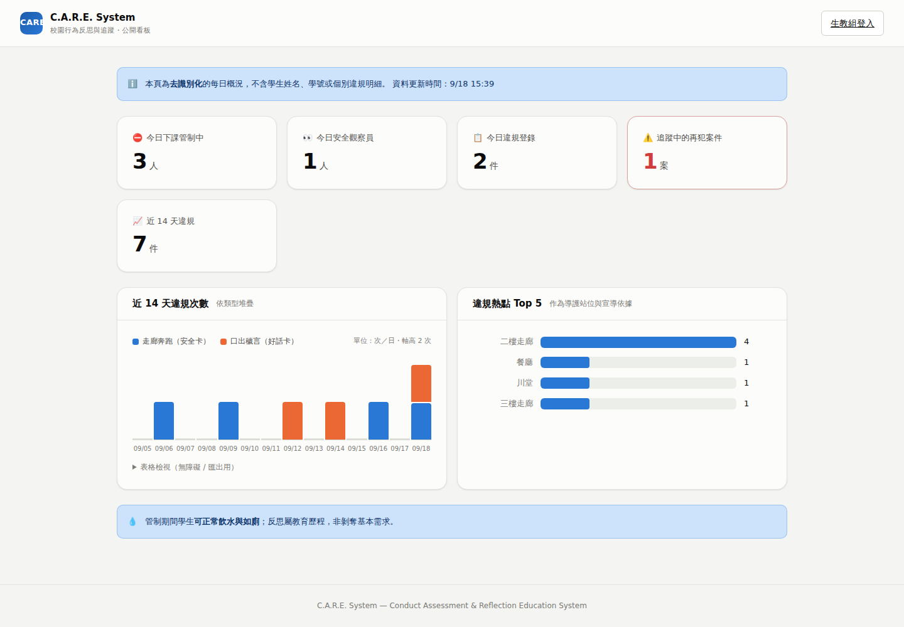
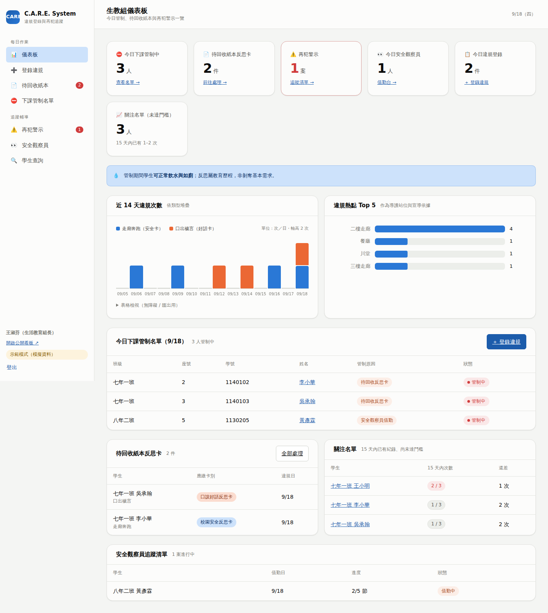
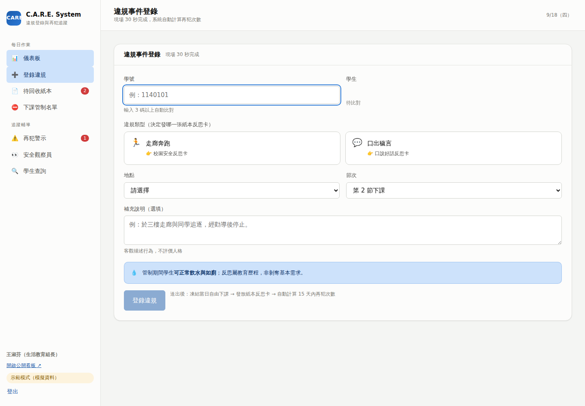
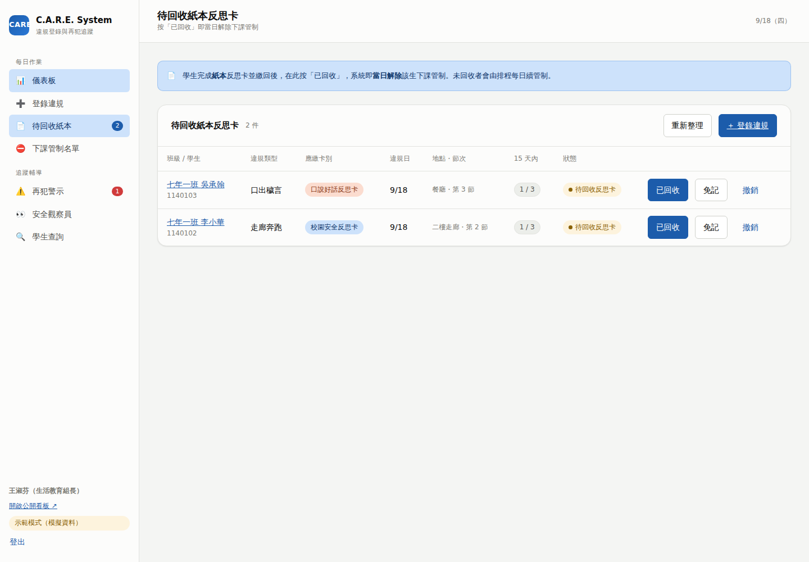
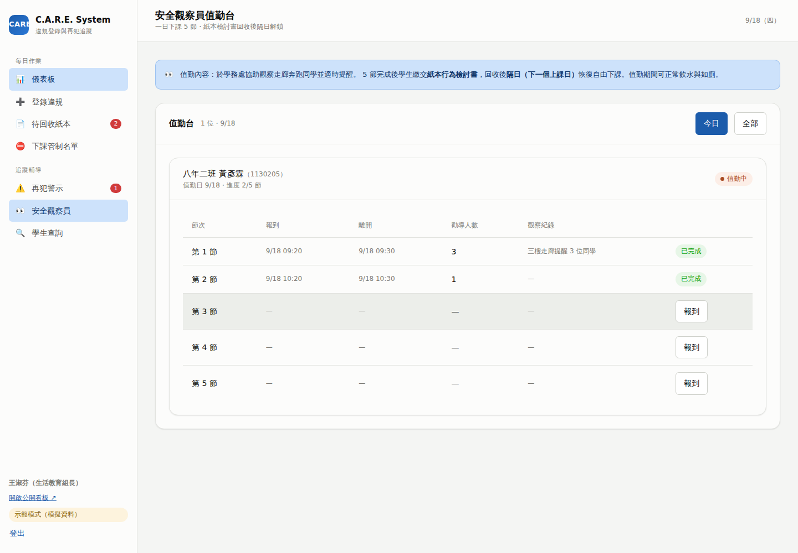
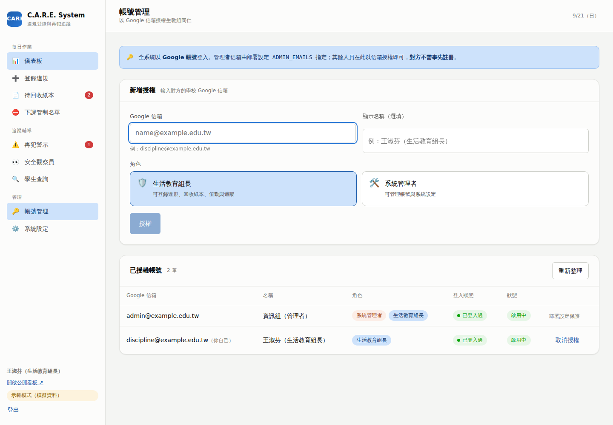
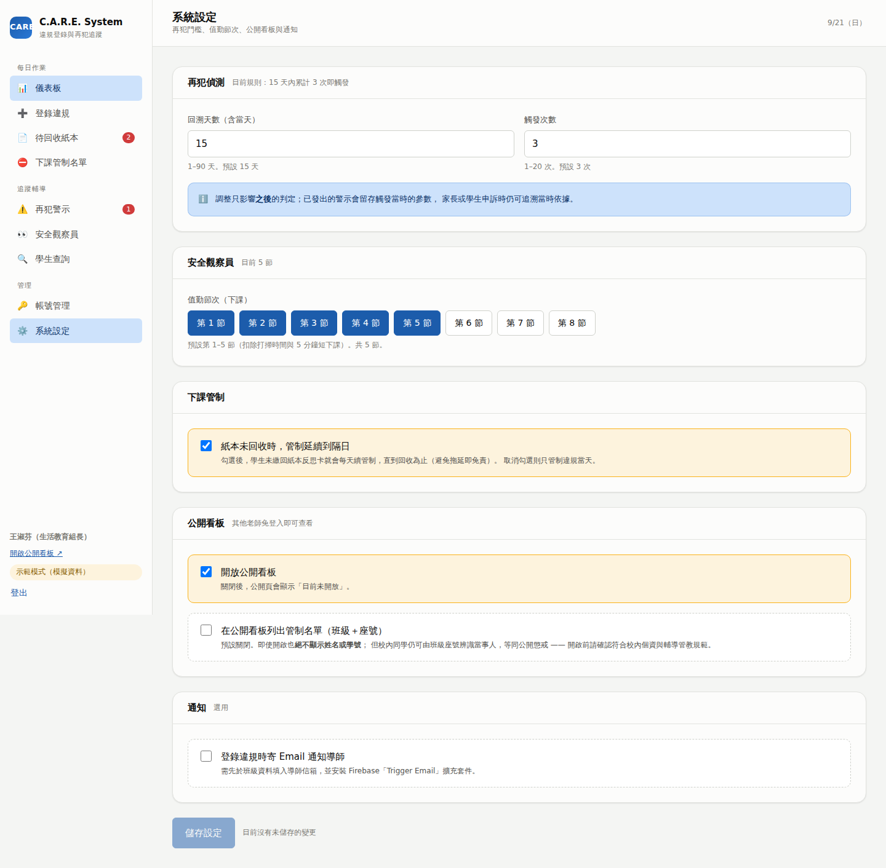
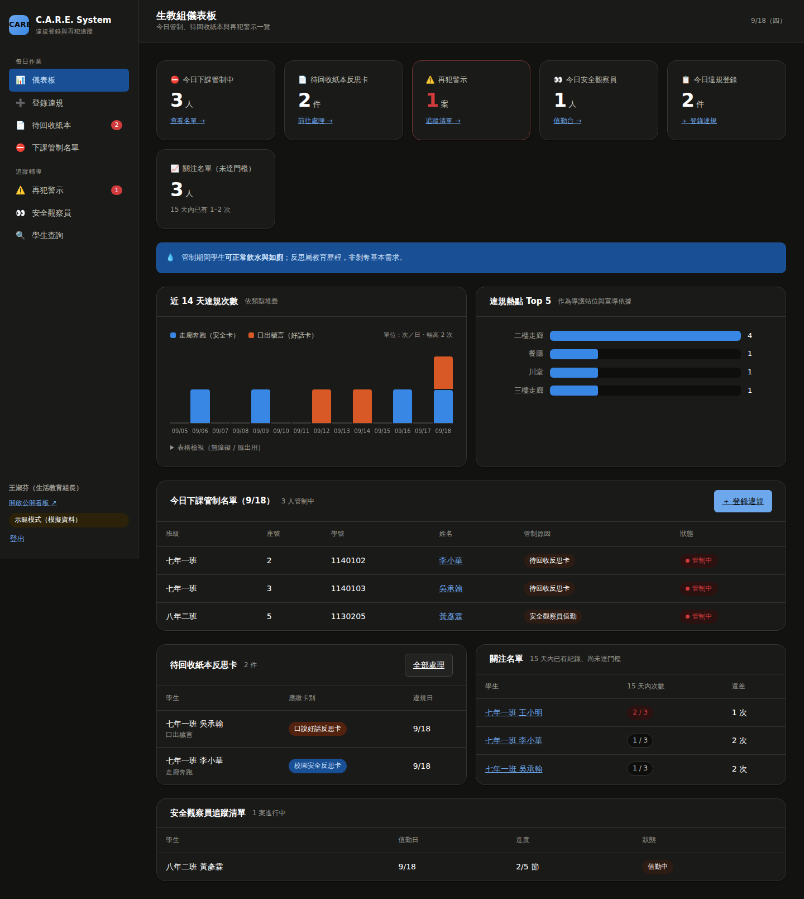

# 操作介面 UI 規劃

> 實作位置：[`web/src/pages/`](../web/src/pages)．設計代幣：[`web/src/styles/tokens.css`](../web/src/styles/tokens.css)
> 下方截圖皆為實際執行的前端（示範模式資料）。

## 1. 使用情境（設計的出發點）

系統只有**一位操作者**：生活教育組長。他的時間被下課鐘切成 10 分鐘一段：

| 時段 | 情境 | 介面必須做到 |
|---|---|---|
| 下課鐘響前 1 分鐘 | 想知道「今天誰要管制、誰要來值勤」 | 首頁**免點擊**就看到名單 |
| 下課中（走廊） | 帶學生回來登錄違規 | **30 秒**完成，不需另外查學生資料 |
| 下課中（學務處） | 學生繳回紙本反思卡、觀察員來報到 | **一鍵**標記回收／打卡 |
| 午休 | 處理累積的待回收紙本 | 佇列式作業，一列一按鈕 |
| 學期中 | 個案輔導、親師溝通 | 學生歷程一頁看完 |
| 期末 | 統計與宣導檢討 | 趨勢與熱點可直接截圖進報告 |
| 隨時 | 其他老師問「今天狀況如何？」 | 給公開看板網址，不必開帳號 |

資訊優先序：**今日名單 → 今日待辦 → 再犯個案 → 趨勢分析**。

## 2. 資訊架構

```
公開（免登入）
└── 🌐 公開看板            /                     ← 統計數字・任何人可看

生教組（需登入）
每日作業
├── 📊 儀表板              /admin
├── ➕ 登錄違規            /admin/log
├── 📄 待回收紙本 (n)      /admin/cases
└── ⛔ 下課管制名單        /admin/restrictions   ← 可查任一日、可列印
追蹤輔導
├── ⚠️ 再犯警示 (n)        /admin/alerts
├── 👀 安全觀察員          /admin/observers      ← 值勤打卡 + 檢討書回收
└── 🔍 學生查詢            /admin/students
管理（僅系統管理者可見）
├── 🔑 帳號管理            /admin/users
└── ⚙️ 系統設定            /admin/settings
```

登入一律使用 **Google 帳號**；已登入但尚未被授權者會看到「尚未授權」畫面，
上面說明兩種情況（管理者請確認部署白名單、同仁請聯繫管理者），並提供
「重新檢查授權」按鈕，授權後不必登出再登入。

側邊欄的紅色數字徽章即時顯示待辦件數（待回收紙本、未處理警示）。

## 3. 畫面規劃

### 3.1 公開唯讀看板 `/`（免登入）



- **預設只有統計數字**：今日管制人數、今日安全觀察員、今日違規登錄、
  追蹤中的再犯案件、近 14 天違規件數，加上趨勢圖與熱點圖。
- 頁首明示「本頁為**去識別化**的每日概況，不含學生姓名、學號或個別違規明細」。
- 右上角只有一個「生教組登入」按鈕。
- 若校方確有需要，可由生教組長開啟名單（設定 `publicBoard.showRoster`），
  此時最多只出現「班級＋座號」，**永不顯示姓名**。
  > 提醒：即使只有班級與座號，校內同學仍可辨識當事人，等同公開懲戒；
  > 開啟前請確認符合校內個資與輔導管教規範。

### 3.2 儀表板 `/admin`



```
┌ KPI 磚 ×6 ─────────────────────────────────────────────────────────┐
│ 今日管制中  待回收紙本  ⚠️再犯警示  今日觀察員  今日登錄  關注名單    │
└────────────────────────────────────────────────────────────────────┘
┌ 💧 正向管教提示條（常駐）：管制期間可正常飲水與如廁 ─────────────────┐
┌ 近 14 天違規次數（分類型堆疊）──┐ ┌ 違規熱點 Top 5 ─────────────────┐
┌ 今日下課管制名單 ──────────────────────────── [＋ 登錄違規] ────────┐
┌ 待回收紙本反思卡 ─────────────┐ ┌ 關注名單（15 天內 1–2 次）──────┐
┌ 安全觀察員追蹤清單 ────────────────────────────────────────────────┐
```

**設計決定**

- **KPI 磚不畫圖**：這六個數字的任務是「單一標題數字」，每磚附一個明確的下一步連結。
- **再犯警示磚在 > 0 時轉為警示樣式**（紅框紅字），是唯一允許搶眼的磚。
- **「關注名單」**顯示 15 天內已有 1–2 次的學生 —— 讓輔導能發生在第 3 次之前。
- 姓名一律可點進學生歷程，讓「看到名字 → 了解背景」只要一次點擊。

### 3.3 違規登錄 `/admin/log`



```
學號輸入（3 碼即自動比對）
   └→ 即時顯示「姓名｜班級 座號｜15 天內已 N 次」
違規類型（兩個大按鈕，各自標示會發哪張紙本卡）
   🏃 走廊奔跑   👉 校園安全反思卡
   💬 口出穢言   👉 口說好話反思卡
地點（熱點優先） + 節次 + 補充說明（選填）
   └→ [登錄違規]
```

送出後立即回饋：

```
✅ 已凍結 七年一班 李小華 當日自由下課
✅ 應發：校園安全反思卡
⚠️ 該生 15 天內累計 2 次；再 1 次即觸發再犯警示
```

若當下即達門檻，提示條直接說明「已發出警示並排入安全觀察員追蹤清單，預定值勤日 X」，
生教組長當場就能向學生說明後續處理。

「繼續登錄下一件」按鈕保留在結果卡上 —— 下課時往往一次帶好幾位學生。

### 3.4 待回收紙本 `/admin/cases`



一列一位學生，欄位：班級/學生、違規類型、**應繳卡別**、違規日、地點節次、
**15 天內次數**、狀態，以及三個動作：

| 動作 | 效果 |
|---|---|
| **已回收**（主要按鈕） | 標記紙本回收 → **當日**解除下課管制 |
| **免記** | 填事由（如班級活動優先）→ 不計入再犯、立即解除管制 |
| **撤銷** | 填事由（誤報）→ 不計入再犯、立即解除管制 |

免記與撤銷都會跳出事由輸入（必填），內容寫入稽核軌跡。
頁首常駐說明：未回收者會由排程每日續管制。

### 3.5 再犯警示 `/admin/alerts`

- 頁首常駐規則說明：**15 天內 3 次觸發**，且「已計入的違規會被認列，不會重複觸發」。
  這句話是最常被學生與家長質疑的點，直接寫在畫面上。
- 每列可展開「依據」，列出計入的 3 筆違規（日期 + 類型）—— 申訴時的舉證基礎。
- 操作：`改期`（值勤日遇校外教學）、`撤銷`（誤判；須填理由，會釋回認列額度）。

### 3.6 安全觀察員值勤台 `/admin/observers`



- 頁首說明處分內容與解鎖條件。
- 每位學生一張卡，內含 5 節打卡列：報到、離開、勸導人數、觀察紀錄。
- 一鍵 `報到` / `離開`；離開時追問「提醒了幾位同學」與觀察紀錄
  —— 把處分時間轉成可累積的觀察資料（也成為期末宣導素材）。
- 5 節完成後出現 **「檢討書已回收」** 按鈕：按下後系統計算
  **下一個上課日**為解鎖日，並在卡片上明示「X 月 X 日起恢復自由下課」。

### 3.7 下課管制名單 `/admin/restrictions`

- 可查**任一日期**（含過去），供家長查詢或事後核對。
- 管制原因以徽章呈現（待回收反思卡／安全觀察員值勤／待回收檢討書）；
  同一人同日可有多個來源，只有全部解除才顯示「已解除」。
- `列印`按鈕輸出可張貼於值班台的名單（列印時自動隱藏側邊欄與按鈕）。

### 3.8 學生查詢與歷程 `/admin/students/:id`

- 上方四格：15 天內再犯次數（附進度條）、累計違規、再犯警示次數、值勤次數。
- 未達門檻但已有紀錄者顯示提示：「再 N 次即觸發，建議提前安排晤談」。
- 下方為違規歷程表（日期、類型、地點節次、狀態、紙本回收日、備註/事由）
  與再犯警示紀錄，一頁完成親師溝通所需的敘事。

### 3.9 帳號管理 `/admin/users`（僅管理者）



- 以 **Google 信箱**授權，對方**不需事先註冊**：授權先存起來，
  待其首次以 Google 登入時自動生效。
- 角色兩種：生活教育組長（日常作業）、系統管理者（另可管帳號與設定）。
- 清單顯示「登入狀態」（已登入過／待首次登入），讓管理者知道對方是否已啟用。
- 可隨時「取消授權」，系統同時讓該帳號的登入憑證失效。
- 列於部署設定 `ADMIN_EMAILS` 的信箱標示「部署設定保護」，不可從畫面移除，
  避免誤把自己鎖在系統外。

### 3.10 系統設定 `/admin/settings`（僅管理者）



校規參數全部在畫面上調整，不需改程式：

| 區塊 | 可調項目 |
|---|---|
| 再犯偵測 | 回溯天數（1–90，預設 15）、觸發次數（1–20，預設 3） |
| 安全觀察員 | 值勤節次（第 1–8 節多選，預設 1–5；節數自動同步） |
| 下課管制 | 紙本未回收時是否續管制到隔日 |
| 公開看板 | 是否開放、是否列出管制名單（班級＋座號，預設關閉） |
| 通知 | 登錄違規時是否寄 Email 通知導師（預設關閉） |

畫面上常駐一句提醒：**調整只影響之後的判定**，已發出的警示會留存觸發當時的參數，
家長或學生申訴時仍可追溯當時依據。未儲存時「儲存設定」才會啟用，並可一鍵取消變更。

## 4. 狀態與色彩系統

| 用途 | 代幣 | 規則 |
|---|---|---|
| 介面 | `--surface-*` / `--ink-*` / `--line-*` | 結構用色，不帶語意 |
| 狀態 | `--status-good/warning/serious/critical` | **固定四色**，一律搭配文字或圖示，不以顏色單獨表意 |
| 資料 | `--series-1`（藍）/ `--series-2`（橘） | 固定指派：slot 1 = 走廊奔跑、slot 2 = 口出穢言，不循環重用 |

案件狀態徽章對照：

| 狀態 | 顯示文字 | 色調 |
|---|---|---|
| `OPEN` | 待回收反思卡 | warning |
| `DONE` | 已回收・已解除 | good |
| `EXEMPTED` | 免記 | 中性 |
| `VOIDED` | 已撤銷 | 中性 |

**深色模式**為獨立色階（非自動反轉），同時支援系統設定與 `data-theme` 覆寫：



## 5. 無障礙與資料呈現規範

- 兩個資料系列同時存在時**必有圖例**，並提供「表格檢視」可展開
  —— 識別不靠顏色單獨傳達，同時方便複製進期末報告。
- 分類色經色盲（CVD）模擬驗證：淺色模式 ΔE 24.7、深色模式 ΔE 26.8（門檻 ≥ 8）。
- 所有數字欄位使用等寬數字（`tabular-nums`），更新時不跳動。
- 焦點環（`:focus-visible`）全域可見，鍵盤可完成登錄與回收。
- 趨勢圖以 HTML/CSS 繪製，座標軸文字不會因 SVG 非等比縮放而變形。
- 版面於 900px 以下改為單欄、側邊欄轉為橫向捲動導覽（學務處平板可用）。

## 6. 後續迭代建議

1. **匯出報表**：期末統計目前以表格檢視複製；可加 CSV／Excel 匯出。
2. **批次登錄**：一次帶回多位學生時，可加「同類型連續登錄」模式。
3. **家長查詢**：若要開放，建議用一次性連結而非開帳號，且僅限本人子女。
4. **離線登錄**：走廊訊號不佳時可加 PWA 離線佇列，回線後補送。
