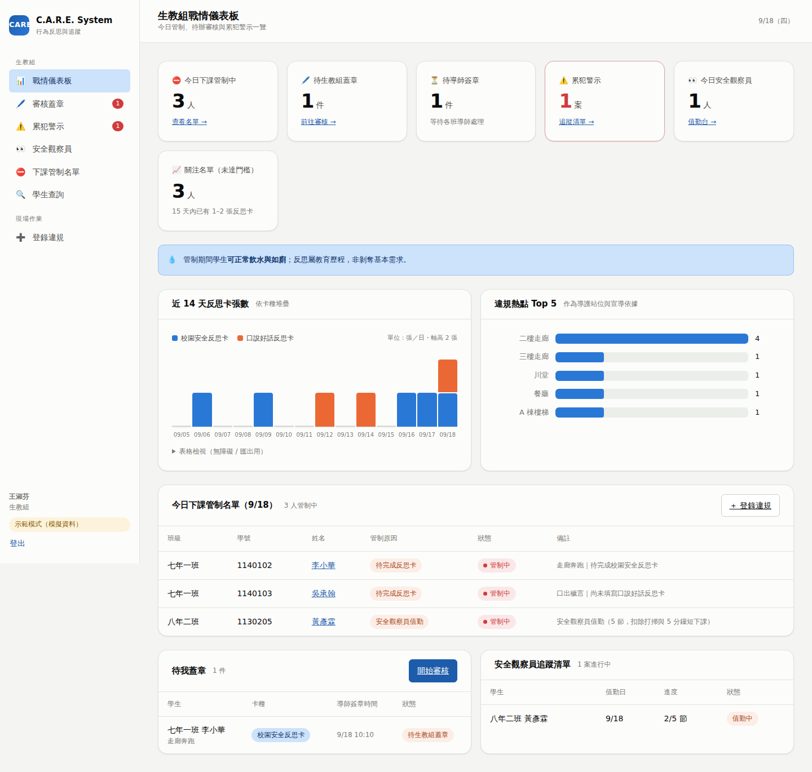
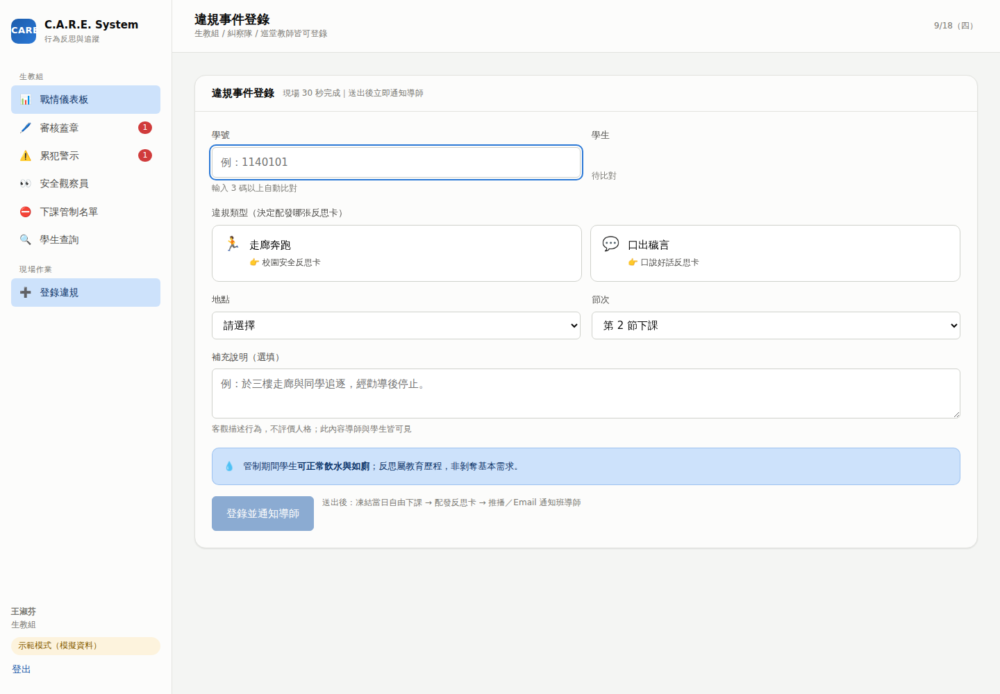
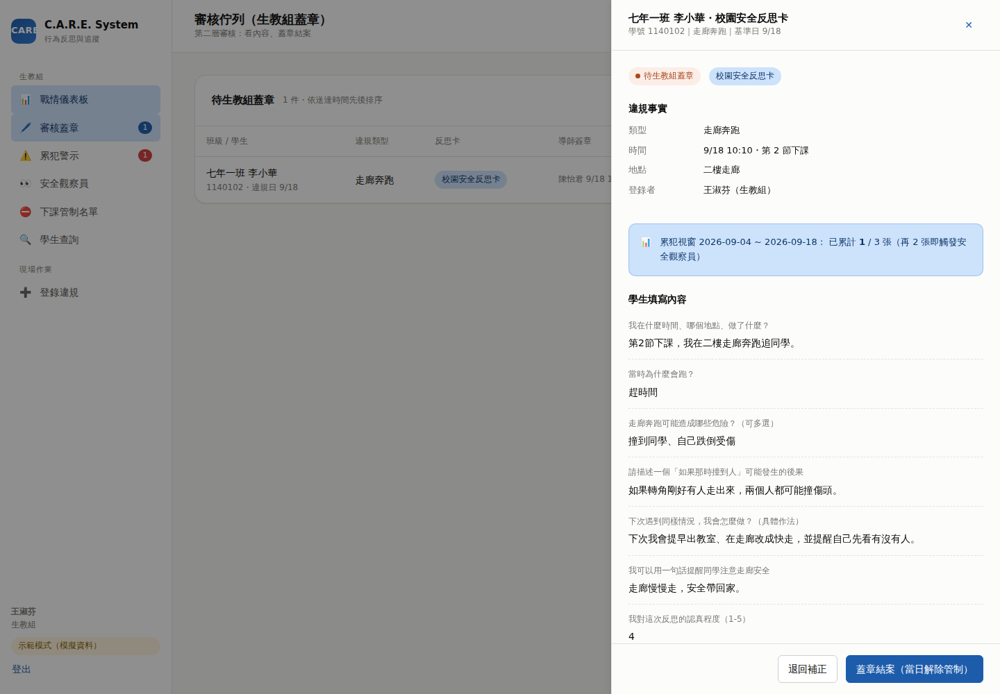
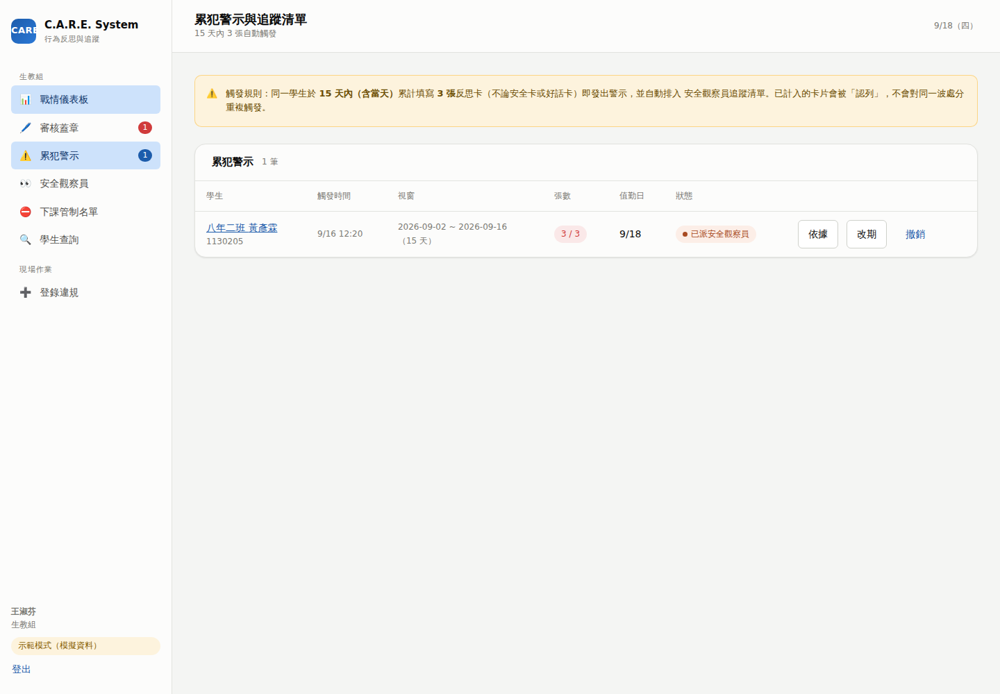
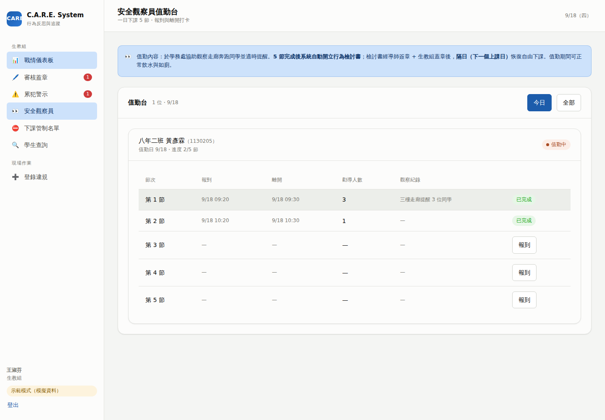
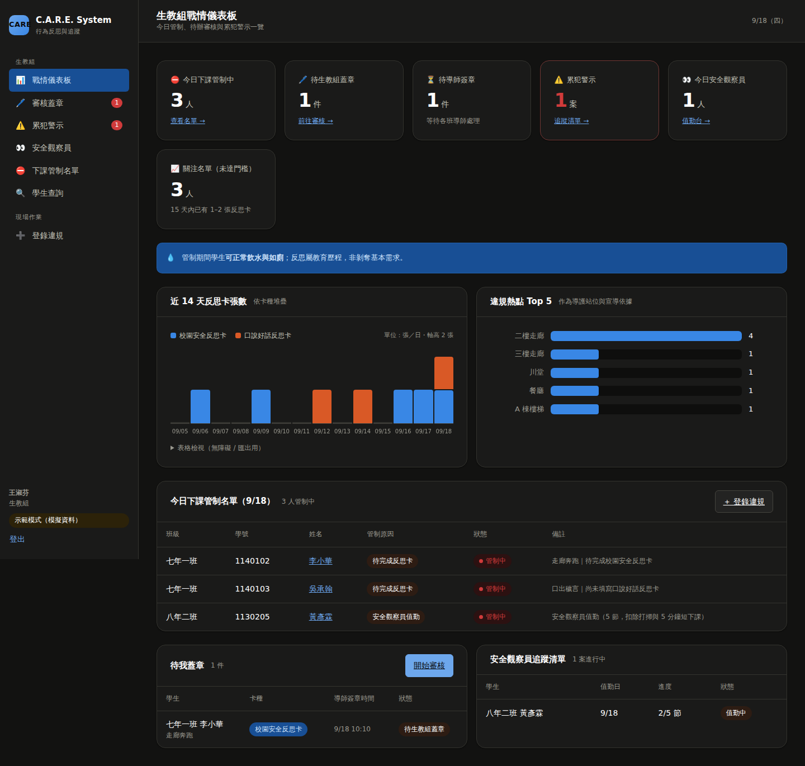

# 生教組端操作介面 UI 規劃

> 實作位置：[`web/src/pages/`](../web/src/pages)．設計代幣：[`web/src/styles/tokens.css`](../web/src/styles/tokens.css)
> 下方畫面截圖皆為實際執行的前端（示範模式資料）。

## 1. 使用情境（設計的出發點）

生教組的作業節奏不是「坐在辦公室填表」，而是被下課鐘切成 10 分鐘一段：

| 時段 | 情境 | 介面必須做到 |
|---|---|---|
| 下課鐘響前 1 分鐘 | 值班老師想知道「今天誰要管制、誰要來值勤」 | 首頁**免點擊**就看到名單 |
| 下課中（走廊） | 糾察隊帶學生來登錄違規 | **30 秒**完成登錄，不需查學生資料 |
| 下課中（學務處） | 學生來填卡、觀察員來報到 | 學生自助填寫；報到**一鍵打卡** |
| 午休 / 第 7 節 | 批次審核蓋章 | 佇列式作業，一件接一件不離開列表 |
| 學期中 | 個案輔導、親師溝通 | 學生歷程一頁看完 |
| 期末 | 統計與宣導檢討 | 趨勢與熱點可直接截圖進報告 |

因此資訊優先序定為：**今日名單 → 我的待辦 → 警示個案 → 趨勢分析**。

## 2. 資訊架構

```
生教組
├── 📊 戰情儀表板      /office               ← 登入後預設頁
├── 🖊️ 審核蓋章 (n)    /office/review        ← 第二層審核佇列
├── ⚠️ 累犯警示 (n)    /office/alerts        ← 觸發個案與追蹤清單
├── 👀 安全觀察員      /office/observers     ← 值勤台（打卡）
├── ⛔ 下課管制名單    /office/restrictions  ← 可查任一日、可列印
└── 🔍 學生查詢        /office/students      ← 個人行為歷程
現場作業
└── ➕ 登錄違規        /office/log           ← 生教組／糾察隊／巡堂教師共用
```

側邊欄的紅色數字徽章即時顯示待辦件數（待蓋章、未處理警示），
讓生教組不必進頁面就知道有沒有事情要做。

## 3. 畫面規劃

### 3.1 戰情儀表板 `/office`



**版面（自上而下）**

```
┌ KPI 磚 ×6 ─────────────────────────────────────────────────────────┐
│ 今日管制中  待生教組蓋章  待導師簽章  ⚠️累犯警示  今日觀察員  關注名單 │
│    3 人         1 件        1 件       1 案       1 人      3 人   │
│  查看名單→     前往審核→               追蹤清單→   值勤台→           │
└────────────────────────────────────────────────────────────────────┘
┌ 💧 正向管教提示條（常駐）：管制期間學生可正常飲水與如廁 ─────────────┐
└────────────────────────────────────────────────────────────────────┘
┌ 近 14 天反思卡張數（分卡種堆疊）──┐ ┌ 違規熱點 Top 5 ──────────────┐
│ ▮安全卡 ▮好話卡   hover 顯示明細  │ │ 二樓走廊 ████████████ 4      │
│ ▸ 表格檢視（無障礙／匯出用）      │ │ 三樓走廊 ███ 1               │
└──────────────────────────────────┘ └──────────────────────────────┘
┌ 今日下課管制名單 ────────────────────────────── [＋ 登錄違規] ─────┐
│ 班級 │ 學號 │ 姓名 │ 管制原因 │ 狀態 │ 備註                        │
└────────────────────────────────────────────────────────────────────┘
┌ 待我蓋章 ──────────────[開始審核]─┐ ┌ 安全觀察員追蹤清單 ──────────┐
└──────────────────────────────────┘ └──────────────────────────────┘
```

**設計決定**

- **KPI 磚不畫圖**：這六個數字的任務是「單一標題數字」，加迷你圖只會增加噪音；
  每磚附一個明確的下一步連結，避免「看到數字卻不知道要做什麼」。
- **累犯警示磚在 > 0 時轉為警示樣式**（紅框 + 紅字），是唯一允許搶眼的磚。
- **「關注名單」磚**顯示 15 天內已有 1–2 張反思卡的人數 —— 把系統從處分工具
  變成預警工具，讓輔導能發生在第 3 張之前。
- **管制名單直接放首頁**（非收在子頁），因為這是下課前最常看的一張表。
- 姓名一律可點進學生歷程，讓「看到名字 → 了解背景」只要一次點擊。

### 3.2 違規事件登錄 `/office/log`



**流程（目標 30 秒）**

```
學號輸入（3 碼即自動比對）
   └→ 即時顯示「姓名｜班級｜15 天內 N 張」三段確認資訊
違規類型（兩個大按鈕，各自標示會配發哪張卡）
   🏃 走廊奔跑   👉 校園安全反思卡
   💬 口出穢言   👉 口說好話反思卡
地點（熱點優先排序） + 節次（下拉） + 補充說明（選填）
   └→ [登錄並通知導師]
```

**送出後立即回饋三件事**（避免「按了不知道有沒有成功」）：

```
✅ 已凍結 七年一班 李小華 當日自由下課
✅ 已推播／Email 通知班導師
✅ 已配發：校園安全反思卡
⚠️ 該生 15 天內累計 2 張反思卡；再 1 張即觸發累犯警示
```

若登錄後即達門檻，提示條會直接說明「已發出累犯警示並排入安全觀察員追蹤清單」，
生教組當場就能跟學生說明後續處理，不必事後補通知。

**細節**

- 學號欄位 `autoFocus` + 數字鍵盤（`inputMode="numeric"`），平板單手可操作。
- 比對不到學號時顯示「查無此學號」而非靜默失敗。
- 補充說明的提示文字寫明「客觀描述行為，不評價人格；導師與學生皆可見」，
  用欄位提示引導符合正向管教的紀錄方式。
- 「繼續登錄下一件」按鈕保留在結果卡上 —— 下課時往往一次帶好幾位學生。

### 3.3 審核蓋章 `/office/review`（第二層審核）



列表欄位：班級/學生、違規類型、反思卡、導師簽章時間、**累犯進度（n/3）**、狀態、操作。
依導師簽章時間先進先出排序，符合「先送的先處理」的行政公平性。

點「審核蓋章」開**右側抽屜**（不離開列表 → 可連續處理）。抽屜內四段資訊：

1. **違規事實**：類型、時間與節次、地點、登錄者（含角色）、補充說明
2. **累犯進度提示條**：`累犯視窗 09/04 ~ 09/18：已累計 1 / 3 張（再 2 張即觸發安全觀察員）`
3. **學生逐題作答**：題目為灰色小字、作答為正常字級，快速掃讀
4. **簽核軌跡**：導師是誰、幾點簽的、寫了什麼

底部固定兩個動作：`退回補正`（必填原因）／`蓋章結案（當日解除管制）`。

**設計決定**

- 抽屜而非跳頁：批次審核時不重新載入列表，減少等待與失焦。
- 把累犯進度放在審核畫面，讓蓋章前就知道「這是第幾張」，
  必要時可在意見欄留下輔導紀錄，而不是等警示發出才反應。
- 退回原因必填（後端也強制），符合正向管教的說明義務。
- 按鈕文字寫出後果（「當日解除管制」），而非只寫「確認」。

### 3.4 累犯警示 `/office/alerts`



- 頁首常駐規則說明：**15 天內 3 張觸發**，且「已計入的卡片會被認列，不會重複觸發」。
  這句話是生教組最常被學生與家長質疑的點，直接寫在畫面上。
- 每列可展開「依據」，列出計入的 3 張卡片（日期 + 卡種 + 卡片 ID）—— 申訴時的舉證基礎。
- 操作：`改期`（值勤日遇校外教學）、`撤銷`（誤判；須填理由，寫入稽核軌跡並釋回卡片認列）。
- 狀態徽章：待確認（紅）→ 已確認（黃）→ 已派安全觀察員（橘）→ 已結案（綠）／已撤銷（灰）。

### 3.5 安全觀察員值勤台 `/office/observers`



- 頁首說明處分內容與解鎖條件：「5 節完成後系統自動開立行為檢討書；
  經導師簽章 + 生教組蓋章後，**隔日（下一個上課日）**恢復自由下課」。
- 每位學生一張卡，內含 5 節的打卡列：報到時間、離開時間、勸導人數、觀察紀錄。
- 一鍵 `報到` / `離開`；離開時追問「提醒了幾位同學」與觀察紀錄
  ——把處分時間轉成可累積的觀察資料（也成為期末宣導素材）。
- 5 節完成後卡片顯示提示：檢討書已開立，請提醒學生填寫。
- 「今日／全部」切換，預設今日。

### 3.6 下課管制名單 `/office/restrictions`

- 可查**任一日期**（含過去），供家長查詢或事後核對。
- 管制原因以徽章呈現（待完成反思卡／安全觀察員值勤／待檢討書審核），
  同一人同日可有多個來源；只有全部來源解除才顯示「已解除」。
- `列印`按鈕輸出可張貼於值班台的名單。
- 頁尾常駐飲水與如廁提示。

### 3.7 學生查詢與歷程 `/office/students/:id`

- 上方四格：累犯視窗張數（附進度條）、累計違規、累計反思卡、值勤次數。
- 未達門檻但已有紀錄者顯示提示：「再 N 張即觸發，建議提前安排晤談」。
- 下方為時間軸，混合顯示違規登錄 📋、反思卡 📝、累犯警示 ⚠️、值勤 👀，
  一頁完成親師溝通所需的敘事。

## 4. 狀態與色彩系統

| 用途 | 代幣 | 規則 |
|---|---|---|
| 介面 | `--surface-*` / `--ink-*` / `--line-*` | 結構用色，不帶語意 |
| 狀態 | `--status-good/warning/serious/critical` | **固定四色**，一律搭配文字或圖示，不以顏色單獨表意 |
| 資料 | `--series-1`（藍）/ `--series-2`（橘） | 固定指派：slot 1 = 安全卡、slot 2 = 好話卡，不循環重用 |

案件狀態徽章對照：

| 狀態 | 顯示文字 | 色調 |
|---|---|---|
| `DRAFT` | 未填寫 | 中性 |
| `PENDING_TEACHER` | 待導師簽章 | warning |
| `PENDING_OFFICE` | 待生教組蓋章 | serious |
| `COMPLETED` | 已完成 | good |
| `RETURNED` | 退回補正 | critical |
| `EXEMPTED` | 班級活動優先（不計處分） | 中性 |

**深色模式**為獨立色階（非自動反轉），同時支援系統設定與 `data-theme` 覆寫：



## 5. 無障礙與資料呈現規範

- 兩個資料系列同時存在時**必有圖例**，並提供「表格檢視」可展開
  —— 識別不靠顏色單獨傳達，同時方便複製進期末報告。
- 分類色經色盲（CVD）模擬驗證：淺色模式 ΔE 24.7、深色模式 ΔE 26.8（門檻 ≥ 8）。
- 所有數字欄位使用等寬數字（`tabular-nums`），更新時不跳動。
- 焦點環（`:focus-visible`）全域可見，鍵盤可完成登錄與審核；抽屜支援 `Esc` 關閉。
- 趨勢圖以 HTML/CSS 繪製，座標軸文字不會因 SVG 非等比縮放而變形。
- 版面於 900px 以下改為單欄、側邊欄轉為橫向捲動導覽（學務處平板可用）。

## 6. 權限與畫面可見性

| 角色 | 可見頁面 |
|---|---|
| 生教組 `DISCIPLINE_STAFF` | 全部 7 頁 |
| 班導師 `HOMEROOM_TEACHER` | 待我簽章（限本班）、登錄違規 |
| 糾察隊 `PATROL` | 僅登錄違規 |
| 學生 `STUDENT` | 我的反思卡 |

導覽選單依 Firebase Auth custom claims 的 `roles[]` 動態組成；
但畫面可見性只是體驗，真正的授權在 Firestore 安全規則與 Cloud Functions 內把關。

## 7. 待辦與後續迭代建議

1. **電子簽章筆跡**：目前以 SHA-256 雜湊留存簽章憑據；若校方要求手寫筆跡，
   可在抽屜加入畫布並上傳至 Storage（規則已備妥 `signatures/` 路徑）。
2. **匯出報表**：期末統計目前以表格檢視複製；可加 CSV／Excel 匯出。
3. **家長查詢入口**：現以 Email 通知；若要開放查詢，建議用一次性連結而非開帳號。
4. **離線登錄**：走廊訊號不佳時可加 PWA 離線佇列，回線後補送。
