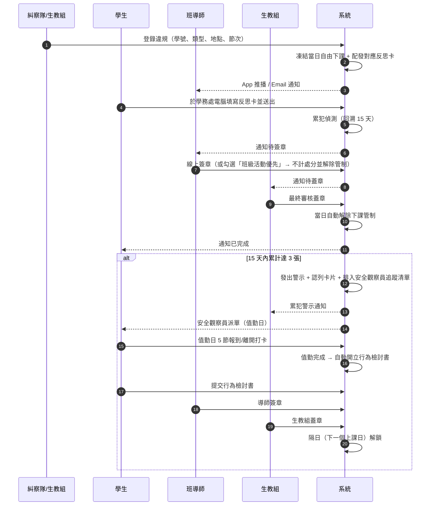

# 業務流程與狀態機

## 1. 全流程總覽



## 2. 案件狀態機（反思卡與行為檢討書共用）

```
      ┌──────────────── 退回補正（必填原因）────────────────┐
      ▼                                                   │
   DRAFT ──送出──▶ PENDING_TEACHER ──導師簽章──▶ PENDING_OFFICE ──生教組蓋章──▶ COMPLETED
      ▲                   │                                                      │
      └── RETURNED ◀──────┴── 導師勾選「班級活動優先」──▶ EXEMPTED               │
                                （不計入處分、解除當日管制）                      │
                                                                                 ▼
                                              反思卡：當日解除管制
                                              檢討書：unlockOn = 下一個上課日
```

實作：[`functions/src/domain/workflow.ts`](../functions/src/domain/workflow.ts)
（純函式，回傳「新狀態 + 副作用清單」；17 項單元測試涵蓋權限、跳關、退回、豁免與解鎖）。

### 關卡權限

| 關卡 | 允許角色 | 前置狀態 |
|---|---|---|
| 送出 | `STUDENT`（本人） | `DRAFT` 或 `RETURNED` |
| 第一層簽章 | `HOMEROOM_TEACHER`（限本班）、`ADMIN` | `PENDING_TEACHER` |
| 第二層蓋章 | `DISCIPLINE_STAFF`、`ADMIN` | `PENDING_OFFICE` |

不可跳關：導師未簽章前，生教組蓋章會被擲回
`STAGE_MISMATCH`（後端擋，不只是前端隱藏按鈕）。

## 3. 副作用（effects）

狀態機不直接寫資料庫，而是回傳 effect 由 `services/caseService.ts` 執行：

| Effect | 實際動作 |
|---|---|
| `EVALUATE_RECIDIVISM` | 以違規日為基準跑累犯偵測交易 |
| `LIFT_RESTRICTION` | 移除該日管制的對應來源；所有來源清空才真正解鎖 |
| `EXEMPT_INFRACTION` | 違規事件標記 `EXEMPTED` 並寫入豁免事由與簽核者 |
| `SCHEDULE_UNLOCK` | 寫入派單 `unlockOn`，並清除解鎖日後的續帳管制 |
| `CLOSE_ASSIGNMENT` | 派單與累犯警示一併結案 |
| `NOTIFY` | 發送 FCM 推播與 Email（依 `settings.notifications` 開關） |

## 4. 下課管制的生命週期

| 時點 | 動作 |
|---|---|
| 違規登錄 | 建立 `recessRestrictions/{studentId}_{違規日}`，原因 `INFRACTION_REFLECTION` |
| 反思卡完成雙重審核 | 移除該原因 → 若無其他原因則當日 `LIFTED` |
| 導師豁免 | 同上（立即解除） |
| 累犯觸發 | 於值勤日建立管制，原因 `OBSERVER_DUTY`，節次 `[1..5]` |
| 值勤完成、檢討書未通過 | 排程每日 07:10 續帳，原因 `OBSERVER_REVIEW_PENDING` |
| 檢討書通過 | `unlockOn = nextSchoolDay(完成日)`；該日起不再續帳＝自動解鎖 |
| 反思卡逾日未完成 | 排程續帳到當日（管制延續至完成，避免拖延即免責） |

排程作業：[`functions/src/handlers/scheduled.ts`](../functions/src/handlers/scheduled.ts)

| 排程 | 時間（Asia/Taipei） | 作用 |
|---|---|---|
| `dailyRecessRollForward` | 上課日 07:10 | 未結案管制續帳、已達解鎖日者自動解鎖 |
| `pendingApprovalReminder` | 上課日 15:40 | 提醒導師與生教組仍有待簽／待蓋章案件 |

## 5. 正向管教的落實點

| 規範要求 | 系統做法 |
|---|---|
| 不得剝奪基本需求 | 所有管制文件 `allowWaterAndRestroom: true`，前端各頁常駐提示 |
| 處分須有說明 | 退回補正必填原因；蓋章按鈕明示後果 |
| 教育重於處罰 | 反思卡題目採事件回顧→風險思考→同理→承諾四段式；檢討書要求可檢核的改善計畫 |
| 可申訴、可追溯 | 每次簽章存 SHA-256 雜湊；警示留存參數快照與認列卡片明細；`auditLogs` 完整紀錄 |
| 避免重複處分 | 卡片認列機制確保同一波違規只處分一次 |
| 尊重班級活動 | 導師可勾選「班級活動優先」，該時段不計入處分 |
