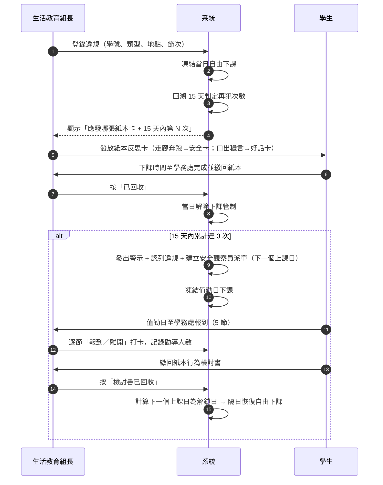

# 作業流程

## 1. 每日流程



## 2. 案件狀態

```
  OPEN ──「已回收」──▶ DONE（當日解除管制）
   │
   ├──「免記」（班級活動優先等，須填事由）──▶ EXEMPTED（不計入再犯、立即解除）
   └──「撤銷」（誤報，須填事由）────────────▶ VOIDED（不計入再犯、立即解除）
```

- 只有 `OPEN` 可以按「已回收」（`assertCanReturnPaper`）。
- `EXEMPTED` / `VOIDED` 已結案，不可重複處理；`DONE` 仍可事後更正為免記或撤銷。
- 免記與撤銷**必填事由**，寫入 `auditLogs`（`assertCanAnnotate`）。

實作：[`web/src/core/domain/caseRules.ts`](../web/src/core/domain/caseRules.ts)（10 項單元測試）。

## 3. 安全觀察員派單狀態

```
SCHEDULED ──首次報到──▶ IN_PROGRESS ──5 節完成──▶ DUTY_COMPLETED
                                                        │
                                          「檢討書已回收」│
                                                        ▼
                                    CLOSED（unlockOn = 下一個上課日）

（誤判撤銷警示時 → CANCELLED，並解除值勤日管制）
```

## 4. 下課管制的生命週期

| 時點 | 動作 |
|---|---|
| 違規登錄 | 建立 `recessRestrictions/{studentId}_{違規日}`，原因 `INFRACTION_PAPER` |
| 紙本反思卡回收 | 移除該原因 → 若無其他原因則當日 `LIFTED` |
| 免記 / 撤銷 | 同上（立即解除） |
| 再犯觸發 | 於值勤日建立管制，原因 `OBSERVER_DUTY`，節次 `[1..5]` |
| 值勤完成、檢討書未回收 | 排程每日 07:10 續帳，原因 `OBSERVER_REVIEW_PENDING` |
| 檢討書回收 | `unlockOn = nextSchoolDay(回收日)`；該日起不再續帳＝自動解鎖 |
| 紙本逾日未回收 | 排程續帳到當日（拖延不等於免責，可由 `carryOverUnfinished` 關閉） |

每日續帳：[`web/src/core/services/dailySync.ts`](../web/src/core/services/dailySync.ts)

免費方案沒有排程函式，因此改在**生教組端每天第一次開啟系統**時執行：
未結案管制續帳、已達解鎖日者不再續帳（＝自動解鎖）、重建公開看板。
以 `systemState/dailySync.lastRunOn` 記錄每天只跑一次；管制帳以「學生＋日期」為鍵，
重複執行不會產生重複資料，連續幾天沒開系統，下次開啟時也會一併補上。

## 5. 正向管教的落實點

| 規範要求 | 系統做法 |
|---|---|
| 不得剝奪基本需求 | 所有管制文件 `allowWaterAndRestroom: true`，各頁常駐提示 |
| 處分須有說明 | 免記／撤銷必填事由；按鈕文字明示後果（「當日解除管制」） |
| 教育重於處罰 | 系統只管追蹤，反思內容仍由紙本引導；關注名單讓輔導提前於第 3 次之前 |
| 可申訴、可追溯 | 警示留存參數快照與認列明細；`auditLogs` 完整紀錄每次操作 |
| 避免重複處分 | 認列機制確保同一波違規只處分一次 |
| 尊重班級活動 | 「免記」可記錄班級活動優先等事由，該次不計入再犯 |
| 隱私保護 | 公開看板預設只有統計數字，不含姓名與個別明細 |
